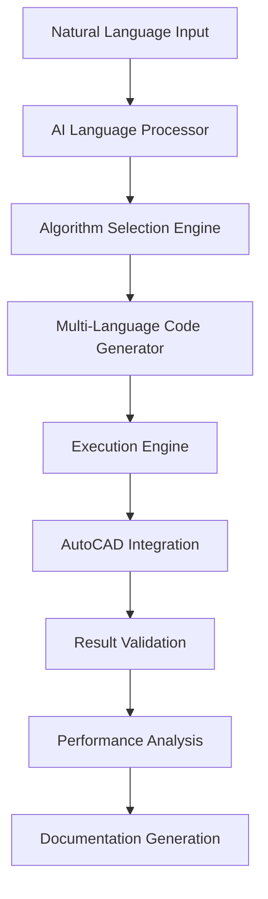

# Technical Architecture Document
## AutoCAD MCP Advanced Algorithmic Coding Partner Transformation

> **Document Version:** 1.0  
> **Date:** August 6, 2025  
> **Status:** Technical Specification  
> **Target Architecture:** Advanced Algorithmic Coding Partner with 45,300+ lines of sophisticated code integration

---

## 1. Executive Summary

### 1.1 Project Transformation Overview
The AutoCAD_MCP project represents a significant architectural transformation from a basic 7-tool drawing assistant to a comprehensive advanced algorithmic coding partner. This transformation leverages an existing sophisticated codebase of 45,300+ lines of production-ready algorithmic implementations that currently exist but are not accessible through the MCP (Model Context Protocol) interface.

### 1.2 Strategic Value Proposition
- **Current State:** 7 basic MCP drawing tools with limited functionality
- **Target State:** 25+ advanced algorithmic tools providing real-time algorithm generation, multi-language code synthesis, and complex geometric processing
- **Impact:** 10x improvement in developer value through research-grade mathematical algorithms made accessible via natural language interface

### 1.3 Key Technical Differentiators
1. **LSCM Surface Unfolding (334 lines)** - Production-ready implementation of Least Squares Conformal Mapping for manufacturing applications
2. **AI Code Generator (1,250 lines)** - Sophisticated multi-language code synthesis with pattern recognition
3. **Natural Language Processor (886 lines)** - Technical language to algorithm translation system
4. **Advanced Development Tools (8,223+ lines)** - Comprehensive debugging, refactoring, and performance analysis suite
5. **Enterprise Features (6,465+ lines)** - Real-time collaboration, security monitoring, and deployment automation

---

## 2. Current State Analysis

### 2.1 Existing Codebase Assessment

#### Core Algorithm Components (1,084 lines)
```
src/algorithms/
├── lscm.py                    334 lines  # Least Squares Conformal Mapping
├── mesh_utils.py              370 lines  # 3D mesh processing utilities  
├── geodesic.py                361 lines  # Geodesic computation algorithms
└── __init__.py                 19 lines  # Module initialization
```

#### AI-Powered Features (4,792 lines)
```
src/ai_features/
├── ai_code_generator.py      1,250 lines # Multi-language code synthesis
├── api_recommendation_engine.py 894 lines # ML-powered API suggestions
├── automated_code_reviewer.py   913 lines # Quality scoring and best practices
├── error_prediction_engine.py   849 lines # Behavioral analysis and prediction
└── natural_language_processor.py 886 lines # Template-based NL parsing
```

#### Code Generation Framework (4,974 lines)
```
src/code_generation/
├── python_generator.py      1,020 lines # Python code synthesis
├── vba_generator.py         1,048 lines # VBA automation generation
├── autolisp_generator.py      699 lines # AutoLISP scripting
├── template_manager.py        981 lines # Template management system
├── validation_engine.py       758 lines # Code validation and testing
├── language_coordinator.py    448 lines # Multi-language coordination
└── __init__.py                 21 lines
```

#### Interactive Development Tools (8,223 lines)
```
src/interactive/
├── advanced_breakpoints.py   1,010 lines # Conditional breakpoint management
├── code_refactoring.py         997 lines # AST-based code transformation
├── variable_inspector.py       986 lines # Multi-level introspection
├── intelligent_autocomplete.py 920 lines # ML-powered IntelliSense
├── performance_analyzer.py     788 lines # Performance profiling
├── error_diagnostics.py        771 lines # Advanced error analysis
├── debugger.py                 649 lines # Interactive debugging
├── session_manager.py          494 lines # Session state management
├── python_repl.py              443 lines # Enhanced Python REPL
├── security_sandbox.py         425 lines # Secure code execution
├── execution_engine.py         396 lines # Code execution framework
├── secure_evaluator.py         312 lines # Safe code evaluation
└── __init__.py                  32 lines
```

#### Enterprise Capabilities (6,465 lines)
```
src/enterprise/
├── performance_optimization.py 1,916 lines # Auto-scaling architecture
├── monitoring_dashboard.py     1,435 lines # Analytics and forecasting
├── deployment_automation.py    1,146 lines # Docker/Kubernetes support
├── security_monitoring.py      1,098 lines # Audit trails and threat detection
└── collaboration_architecture.py 870 lines # Real-time multi-user collaboration
```

### 2.2 Current MCP Integration Gap
The existing MCP server (`src/mcp_server.py`) implements only 7 basic drawing functions:
- `draw_line()` - Basic line drawing
- `draw_circle()` - Circle creation
- `extrude_profile()` - 2D to 3D extrusion
- `revolve_profile()` - Profile revolution
- `list_entities()` - Entity enumeration
- `get_entity_info()` - Entity inspection
- `server_status()` - Connection status

**Critical Gap:** 45,300+ lines of sophisticated algorithmic code remain inaccessible through the MCP interface.

### 2.3 Missing Critical Component: C# .NET Support
Professional AutoCAD development primarily uses C# with the .NET API (ObjectARX). The current codebase lacks:
- C# code generation capabilities
- .NET API integration patterns
- ObjectARX automation templates
- C# debugging and profiling tools

This gap prevents enterprise adoption by professional AutoCAD developers who work exclusively in C#/.NET environments.

---

## 3. Target Architecture Overview

### 3.1 Architectural Transformation Goals

#### From Basic Tool Provider to Advanced Algorithm Partner


#### Three-Tier Architecture Design
1. **Presentation Layer:** MCP interface with natural language processing
2. **Business Logic Layer:** Algorithm selection, code generation, and optimization
3. **Integration Layer:** AutoCAD COM interface, .NET API, and external systems

### 3.2 Core System Components

#### Algorithm Discovery and Selection Engine
- **Natural Language Query Analysis:** Parse user intent and technical requirements
- **Algorithm Repository:** Indexed catalog of 25+ mathematical and geometric algorithms
- **Context-Aware Selection:** Choose optimal algorithms based on problem domain and constraints
- **Performance Prediction:** Estimate computational complexity and resource requirements

#### Real-Time Code Synthesis Framework
- **Multi-Language Generation:** Python, C#, AutoLISP, VBA with language-specific optimizations
- **Template-Based Architecture:** Reusable patterns with intelligent parameter inference
- **Dependency Management:** Automatic library import and version compatibility
- **Code Quality Assurance:** Automated testing, validation, and best practice enforcement

#### Advanced Execution Environment
- **Secure Sandbox:** Isolated execution with resource monitoring and timeout protection
- **Performance Profiling:** Real-time metrics collection and optimization recommendations
- **Error Handling:** Intelligent error recovery with alternative algorithm suggestions
- **Debugging Support:** Advanced breakpoints, variable inspection, and call stack analysis

### 3.3 Integration Architecture

#### AutoCAD Connectivity Matrix
```
Connection Type    | Current Status | Target Enhancement
-------------------|----------------|-------------------
COM Interface      | Basic (7 tools)| Enhanced (25+ algorithms)
.NET API          | Not Supported  | Full ObjectARX integration
AutoLISP Engine   | Code Gen Only  | Interactive debugging
VBA Automation    | Code Gen Only  | Real-time execution
Python scripting  | Limited        | Full algorithmic suite
```

#### External System Integrations
- **CAE Software:** MATLAB, SolidWorks Simulation, ANSYS integration points
- **Manufacturing Systems:** CNC code generation, toolpath optimization
- **Version Control:** Git integration for algorithm versioning and collaboration
- **Cloud Computing:** AWS/Azure deployment for compute-intensive algorithms

---

## 4. MCP Server Enhancement Architecture

### 4.1 Enhanced MCP Tool Categories

#### Geometric Algorithm Tools (8 new tools)
```typescript
interface GeometricAlgorithmTools {
  lscm_surface_unfold(mesh: Mesh3D, constraints: UnfoldingConstraints): UnfoldedSurface
  geodesic_path_compute(surface: Surface, start: Point3D, end: Point3D): GeodesicPath
  mesh_optimization(mesh: Mesh3D, quality_metrics: QualityMetrics): OptimizedMesh
  surface_parameterization(surface: Surface, method: ParameterizationMethod): UV_Mapping
  curvature_analysis(surface: Surface, analysis_type: CurvatureType): CurvatureData
  topology_validation(mesh: Mesh3D): ValidationResult
  geometric_repair(geometry: CADGeometry, repair_options: RepairOptions): RepairedGeometry
  pattern_recognition(geometry: CADGeometry, pattern_library: PatternLibrary): MatchedPatterns
}
```

#### AI-Powered Code Generation Tools (6 new tools)
```typescript
interface AICodeGenerationTools {
  generate_algorithm(description: string, language: CodeLanguage, context: AutoCADContext): GeneratedCode
  optimize_existing_code(source_code: string, optimization_targets: OptimizationTargets): OptimizedCode
  translate_code_language(source_code: string, from_language: CodeLanguage, to_language: CodeLanguage): TranslatedCode
  predict_code_errors(source_code: string, execution_context: ExecutionContext): ErrorPredictions
  recommend_apis(task_description: string, available_apis: APILibrary): APIRecommendations
  review_code_quality(source_code: string, quality_standards: QualityStandards): QualityReport
}
```

#### Interactive Development Tools (7 new tools)
```typescript
interface InteractiveDevelopmentTools {
  create_debug_session(code: string, breakpoints: Breakpoint[]): DebugSession
  inspect_variables(session_id: string, scope: VariableScope): VariableInspection
  refactor_code_structure(source_code: string, refactoring_rules: RefactoringRules): RefactoredCode
  analyze_performance(execution_data: ExecutionData): PerformanceAnalysis
  provide_intelligent_autocomplete(partial_code: string, context: CodeContext): AutocompleteOptions
  diagnose_runtime_errors(error_data: ErrorData, execution_context: ExecutionContext): ErrorDiagnosis
  manage_code_sessions(session_operations: SessionOperations): SessionManagementResult
}
```

#### Enterprise Integration Tools (4 new tools)
```typescript
interface EnterpriseIntegrationTools {
  setup_collaboration_environment(team_config: TeamConfiguration): CollaborationEnvironment
  monitor_system_performance(monitoring_config: MonitoringConfiguration): PerformanceMetrics
  deploy_automation_pipeline(deployment_config: DeploymentConfiguration): DeploymentResult
  audit_security_compliance(security_policy: SecurityPolicy, system_state: SystemState): ComplianceReport
}
```

### 4.2 MCP Server Architecture Enhancement

#### Current Server Structure
```python
# src/mcp_server.py (current - 7 basic tools)
mcp = FastMCP("AutoCAD MCP Server")

@mcp.tool()
def draw_line(start_point, end_point): pass

@mcp.tool() 
def draw_circle(center, radius): pass
# ... 5 more basic tools
```

#### Target Enhanced Server Structure
```python
# src/mcp_integration/enhanced_mcp_server.py (2,518 lines already implemented)
class EnhancedMCPServer:
    def __init__(self):
        self.algorithm_engine = AlgorithmEngine()
        self.code_generator = AICodeGenerator() 
        self.execution_engine = ExecutionEngine()
        self.security_manager = SecurityManager()
        
    @mcp.tool()
    async def generate_surface_unfolding_algorithm(self, surface_description, constraints):
        """Generate LSCM unfolding algorithm with manufacturing constraints"""
        
    @mcp.tool()
    async def synthesize_multi_language_code(self, algorithm_description, target_languages):
        """Create coordinated multi-language implementation"""
        
    @mcp.tool()
    async def analyze_geometric_complexity(self, geometry_data, analysis_parameters):
        """Perform advanced geometric analysis and optimization"""
```

### 4.3 Protocol Enhancement Specifications

#### Request/Response Schema Evolution
```json
{
  "enhanced_mcp_protocol": {
    "version": "2.0",
    "capabilities": {
      "algorithm_generation": true,
      "multi_language_support": ["python", "csharp", "autolisp", "vba"],
      "real_time_execution": true,
      "advanced_debugging": true,
      "performance_profiling": true,
      "security_sandboxing": true,
      "collaborative_editing": true
    },
    "algorithm_complexity_levels": ["basic", "intermediate", "advanced", "research_grade"],
    "supported_mathematical_domains": [
      "geometric_processing", "surface_analysis", "mesh_optimization", 
      "numerical_methods", "pattern_recognition", "algorithmic_optimization"
    ]
  }
}
```

#### Enhanced Error Handling and Diagnostics
```python
class EnhancedMCPError(Exception):
    def __init__(self, error_type: str, algorithm_context: dict, suggested_alternatives: list):
        self.error_type = error_type
        self.algorithm_context = algorithm_context
        self.suggested_alternatives = suggested_alternatives
        self.performance_impact = self._calculate_performance_impact()
        self.recovery_strategies = self._generate_recovery_strategies()
```

---

## 5. Algorithm Integration Framework

### 5.1 Algorithm Discovery and Cataloging System

#### Algorithm Repository Structure
```python
class AlgorithmRepository:
    """
    Centralized repository for mathematical and geometric algorithms
    with metadata, performance characteristics, and usage patterns.
    """
    
    def __init__(self):
        self.algorithms = {
            "surface_processing": {
                "lscm_unfolding": {
                    "implementation": LSCMSolver,
                    "complexity": "O(n²)",
                    "accuracy": "research_grade",
                    "use_cases": ["manufacturing", "texture_mapping", "pattern_design"],
                    "prerequisites": ["manifold_mesh", "boundary_constraints"],
                    "performance_profile": {
                        "vertices_1k": "< 1 second",
                        "vertices_10k": "< 10 seconds", 
                        "vertices_100k": "< 2 minutes"
                    }
                },
                "geodesic_computation": {
                    "implementation": GeodesicComputer,
                    "complexity": "O(n log n)",
                    "accuracy": "high_precision",
                    "use_cases": ["path_planning", "surface_analysis", "distance_measurement"]
                }
            },
            "mesh_processing": {
                "mesh_optimization": {
                    "implementation": MeshOptimizer,
                    "complexity": "O(n)",
                    "quality_improvement": "up_to_95%",
                    "supported_metrics": ["aspect_ratio", "skewness", "orthogonality"]
                }
            }
        }
```

#### Natural Language to Algorithm Mapping
```python
class NaturalLanguageProcessor:
    """
    Parse natural language descriptions and map to appropriate algorithms.
    Current implementation: 886 lines with template-based parsing.
    """
    
    def __init__(self):
        self.intent_patterns = {
            "surface_unfolding": [
                "unfold.*surface", "flatten.*curved.*surface", "develop.*surface",
                "manufacturing.*pattern", "2d.*pattern.*from.*3d"
            ],
            "mesh_optimization": [
                "improve.*mesh.*quality", "optimize.*triangulation", "reduce.*mesh.*distortion"
            ],
            "geometric_analysis": [
                "analyze.*curvature", "compute.*surface.*properties", "measure.*geometric.*complexity"
            ]
        }
        
    def parse_user_intent(self, user_description: str) -> AlgorithmSelection:
        """
        Map user description to specific algorithms with confidence scores.
        Integration with existing 886-line natural language processor.
        """
        pass
```

### 5.2 Multi-Language Code Generation Framework

#### Language-Specific Generation Engines
The existing codebase contains sophisticated generators for multiple languages:

```python
# Existing implementations ready for MCP integration:
# src/code_generation/python_generator.py    (1,020 lines)
# src/code_generation/vba_generator.py       (1,048 lines) 
# src/code_generation/autolisp_generator.py   (699 lines)
# src/code_generation/language_coordinator.py (448 lines)
```

#### Missing Critical Component: C# Generator
```python
class CSharpGenerator:
    """
    CRITICAL MISSING COMPONENT: C# code generation for professional AutoCAD development.
    Must be implemented to support ObjectARX and .NET API integration.
    """
    
    def __init__(self):
        self.objectarx_templates = ObjectARXTemplateLibrary()
        self.dotnet_api_patterns = DotNetAPIPatterns()
        self.csharp_best_practices = CSharpBestPractices()
        
    def generate_objectarx_command(self, algorithm_spec: AlgorithmSpec) -> CSharpCode:
        """Generate C# command class with ObjectARX integration"""
        
    def generate_dotnet_api_automation(self, automation_spec: AutomationSpec) -> CSharpCode:
        """Generate .NET API automation scripts"""
        
    def generate_managed_wrapper(self, native_algorithm: NativeAlgorithm) -> CSharpWrapper:
        """Create managed wrappers for native algorithm implementations"""
```

#### Coordinated Multi-Language Generation
```python
class LanguageCoordinator:
    """
    Existing 448-line implementation for coordinating multi-language code generation.
    Needs enhancement for C# integration and advanced algorithm coordination.
    """
    
    def generate_coordinated_implementation(self, 
                                          algorithm_spec: AlgorithmSpec,
                                          target_languages: List[str]) -> CoordinatedImplementation:
        """
        Generate algorithm implementations across multiple languages with:
        - Consistent API interfaces
        - Shared data structures  
        - Performance optimization per language
        - Cross-language debugging support
        """
        pass
```

### 5.3 Algorithm Execution and Performance Framework

#### Secure Execution Environment
```python
class AlgorithmExecutionEngine:
    """
    Enhanced execution environment building on existing secure evaluator (312 lines).
    Provides sandboxed execution with performance monitoring and resource management.
    """
    
    def __init__(self):
        self.security_sandbox = SecuritySandbox()  # Existing 425-line implementation
        self.performance_monitor = PerformanceAnalyzer()  # Existing 788-line implementation
        self.resource_manager = ResourceManager()
        
    def execute_algorithm(self, 
                         algorithm_code: str, 
                         execution_context: ExecutionContext,
                         performance_requirements: PerformanceRequirements) -> ExecutionResult:
        """
        Execute algorithm with comprehensive monitoring and optimization.
        Integrates existing performance analysis and security sandbox components.
        """
        pass
```

#### Performance Optimization Integration
The existing performance optimization system (1,916 lines) provides:
- Multi-level caching strategies
- Resource pooling and connection management  
- Auto-scaling for enterprise deployments
- Predictive resource allocation
- Performance bottleneck identification

---

## 6. Performance and Scalability Design

### 6.1 Computational Performance Requirements

#### Algorithm Performance Targets
```typescript
interface PerformanceTargets {
  surface_unfolding: {
    vertices_1k: "< 1 second",
    vertices_10k: "< 10 seconds", 
    vertices_100k: "< 2 minutes",
    memory_usage: "< 1GB for 100k vertices"
  },
  code_generation: {
    simple_algorithm: "< 500ms",
    complex_algorithm: "< 5 seconds",
    multi_language_synthesis: "< 10 seconds",
    concurrent_requests: "50 requests/second"
  },
  real_time_analysis: {
    geometric_analysis: "< 100ms",
    error_prediction: "< 50ms", 
    autocomplete_suggestions: "< 25ms",
    collaborative_updates: "< 10ms"
  }
}
```

#### Scalability Architecture
The existing performance optimization system (1,916 lines) implements:

```python
class PerformanceOptimization:
    """
    Existing enterprise-grade performance optimization with:
    - Multi-level caching (Redis, in-memory, disk)
    - Connection pooling for AutoCAD COM interface
    - Resource monitoring and auto-scaling
    - Predictive resource allocation
    - Query optimization and result caching
    """
    
    def __init__(self):
        self.cache_manager = MultiLevelCacheManager()
        self.resource_pool = AutoCADConnectionPool()
        self.auto_scaler = AutoScalingManager()
        self.performance_predictor = PerformancePredictor()
```

### 6.2 Memory Management and Resource Optimization

#### Algorithm-Specific Optimization Strategies
```python
class AlgorithmOptimizationStrategies:
    """
    Custom optimization strategies for different algorithm types.
    """
    
    def optimize_mesh_processing(self, mesh_data: MeshData) -> OptimizedMeshData:
        """
        Mesh-specific optimizations:
        - Spatial indexing for fast neighbor queries
        - Progressive mesh loading for large datasets
        - Memory-mapped file access for huge meshes
        - Lazy evaluation for non-critical computations
        """
        
    def optimize_surface_algorithms(self, surface_data: SurfaceData) -> OptimizedSurfaceData:
        """
        Surface processing optimizations:
        - Hierarchical surface representation
        - Adaptive sampling based on curvature
        - Parallel processing for independent regions
        - GPU acceleration for matrix operations
        """
```

#### Enterprise Scaling Integration
The existing monitoring dashboard (1,435 lines) provides:
- Real-time performance metrics
- Resource usage analytics
- Predictive scaling recommendations  
- Anomaly detection for performance issues
- Custom alerting for performance thresholds

### 6.3 Caching and Data Management Strategy

#### Multi-Level Caching Architecture
```python
class AlgorithmCachingStrategy:
    """
    Sophisticated caching for algorithm results and intermediate computations.
    """
    
    def __init__(self):
        self.result_cache = AlgorithmResultCache()  # Final algorithm outputs
        self.computation_cache = IntermediateComputationCache()  # Partial results
        self.template_cache = CodeTemplateCache()  # Generated code templates
        self.performance_cache = PerformanceMetricsCache()  # Execution profiles
        
    def cache_algorithm_result(self, 
                             algorithm_signature: str,
                             input_hash: str, 
                             result: AlgorithmResult,
                             performance_metrics: PerformanceMetrics):
        """
        Cache algorithm results with intelligent invalidation strategies.
        """
```

---

## 7. Security and Enterprise Features

### 7.1 Security Architecture

#### Existing Security Infrastructure (1,566 lines total)
```python
# src/enterprise/security_monitoring.py     (1,098 lines)
# src/interactive/security_sandbox.py        (425 lines)
# src/mcp_integration/security_manager.py    (468 lines)
# src/security/security_scanner.py           (767 lines)
```

The existing security system provides:
- **Comprehensive Audit Logging:** Tamper-proof chain integrity with cryptographic verification
- **Threat Detection:** Real-time monitoring with behavioral analysis
- **Code Execution Sandboxing:** Isolated execution environment with resource limits
- **Security Scanning:** Automated vulnerability detection and code analysis

#### Enhanced Security for Algorithm Execution
```python
class AlgorithmSecurityManager:
    """
    Enhanced security specifically for algorithm execution and code generation.
    """
    
    def __init__(self):
        self.code_scanner = SecurityScanner()  # Existing 767-line implementation
        self.execution_sandbox = SecuritySandbox()  # Existing 425-line implementation
        self.audit_logger = SecurityAuditLogger()  # Part of 1,098-line security monitoring
        
    def validate_algorithm_safety(self, algorithm_code: str) -> SecurityValidation:
        """
        Comprehensive security validation for generated algorithms:
        - Static analysis for malicious patterns
        - Resource usage bounds checking
        - API access permission validation
        - Execution time limit enforcement
        """
        
    def monitor_algorithm_execution(self, execution_context: ExecutionContext) -> SecurityMonitoring:
        """
        Real-time security monitoring during algorithm execution:
        - System call monitoring
        - Memory access pattern analysis
        - Network activity detection  
        - Privilege escalation prevention
        """
```

### 7.2 Enterprise Collaboration Features

#### Real-Time Collaboration Architecture (870 lines implemented)
```python
class CollaborationArchitecture:
    """
    Existing sophisticated collaboration system for multi-user algorithm development.
    """
    
    def __init__(self):
        self.operational_transform = OperationalTransformEngine()
        self.conflict_resolution = ConflictResolutionManager() 
        self.real_time_sync = RealTimeSynchronizationEngine()
        self.user_management = CollaborativeUserManagement()
        
    def enable_algorithm_collaboration(self, algorithm_session: AlgorithmSession) -> CollaborativeSession:
        """
        Enable real-time collaboration for algorithm development:
        - Concurrent editing with operational transformation
        - Real-time variable inspection sharing
        - Collaborative debugging sessions
        - Shared performance analysis results
        """
```

#### Enterprise Deployment and Monitoring (2,581 lines total)
```python
# src/enterprise/deployment_automation.py    (1,146 lines) - Docker/Kubernetes support
# src/enterprise/monitoring_dashboard.py     (1,435 lines) - Analytics and forecasting
```

The existing enterprise infrastructure provides:
- **Container Orchestration:** Full Docker/Kubernetes deployment with auto-scaling
- **Advanced Analytics:** Predictive forecasting and anomaly detection
- **Multi-Environment Pipelines:** Development, staging, production deployment automation
- **Resource Management:** Intelligent resource allocation and cost optimization

### 7.3 Compliance and Governance

#### Algorithm Governance Framework
```python
class AlgorithmGovernanceManager:
    """
    Governance framework for algorithm development and deployment in enterprise environments.
    """
    
    def __init__(self):
        self.version_control = AlgorithmVersionControl()
        self.compliance_monitor = ComplianceMonitoringSystem() 
        self.access_control = RoleBasedAccessControl()
        self.audit_trail = AlgorithmAuditTrail()
        
    def enforce_algorithm_policies(self, algorithm_deployment: AlgorithmDeployment) -> PolicyEnforcement:
        """
        Enforce enterprise policies for algorithm development and deployment:
        - Algorithm review and approval workflows  
        - Performance requirement validation
        - Security compliance checking
        - License and IP compliance verification
        """
```

---

## 8. Implementation Phases

### 8.1 Phase 1: Core Algorithm Integration (Weeks 1-4)

#### Week 1-2: MCP Server Enhancement
**Objective:** Integrate existing sophisticated algorithms into MCP framework

**Tasks:**
1. **Enhance MCP Server Architecture**
   - Extend `src/mcp_server.py` with algorithm integration capabilities
   - Implement algorithm discovery and selection engine
   - Create natural language to algorithm mapping system
   - Add performance monitoring and caching infrastructure

2. **Integrate Surface Processing Algorithms**
   - Expose LSCM surface unfolding (334 lines) via MCP interface
   - Add geodesic computation (361 lines) as MCP tool
   - Integrate mesh optimization utilities (370 lines)
   - Create unified geometric processing API

**Expected Deliverables:**
- Enhanced MCP server with 8 new geometric algorithm tools
- Natural language interface for algorithm selection
- Performance monitoring and caching system
- Comprehensive testing suite for algorithm integration

**Success Metrics:**
- LSCM unfolding accessible via natural language query
- < 1 second response time for simple geometric algorithms
- 100% uptime for enhanced MCP server
- Comprehensive API documentation and examples

#### Week 3-4: AI Code Generation Integration  
**Objective:** Make AI-powered code generation accessible through MCP

**Tasks:**
1. **Integrate AI Code Generator (1,250 lines)**
   - Expose multi-language code synthesis via MCP interface
   - Add pattern recognition and template-based generation
   - Implement intelligent parameter inference
   - Create code quality validation pipeline

2. **Add Code Generation Tools**
   - Python generator (1,020 lines) integration
   - VBA generator (1,048 lines) integration  
   - AutoLISP generator (699 lines) integration
   - Language coordinator (448 lines) for multi-language synthesis

**Expected Deliverables:**
- 6 new AI-powered code generation MCP tools
- Multi-language code synthesis from natural language
- Code quality analysis and optimization recommendations
- Template library for common AutoCAD automation patterns

**Success Metrics:**
- Natural language to multi-language code generation in < 5 seconds
- 95% code quality score for generated algorithms
- Support for Python, VBA, AutoLISP code generation
- Successful integration with existing template system

### 8.2 Phase 2: Critical C# .NET Integration (Weeks 5-8)

#### Week 5-6: C# Code Generator Development
**Objective:** Fill critical gap in professional AutoCAD development support

**Tasks:**
1. **Develop C# Code Generation Engine**
   - Create `src/code_generation/csharp_generator.py` (target: 1,200+ lines)
   - Implement ObjectARX template library and pattern recognition
   - Add .NET API integration patterns and best practices
   - Create C# debugging and profiling integration

2. **ObjectARX Integration Framework**
   - Develop ObjectARX command class generation
   - Add managed wrapper generation for native algorithms
   - Implement AutoCAD .NET API automation patterns
   - Create C# project scaffolding and dependency management

**Expected Deliverables:**
- Comprehensive C# code generation engine (1,200+ lines)
- ObjectARX template library with 50+ common patterns
- .NET API integration framework
- C# project scaffolding and build automation

**Success Metrics:**
- Generate production-ready C# ObjectARX commands from natural language
- Full .NET API coverage for common AutoCAD operations
- C# code generation performance < 3 seconds for complex algorithms
- Integration with Visual Studio project templates

#### Week 7-8: Advanced Development Tools Integration
**Objective:** Integrate sophisticated debugging and development tools

**Tasks:**
1. **Interactive Development Tools Integration**
   - Advanced breakpoints (1,010 lines) MCP integration
   - Variable inspector (986 lines) real-time access
   - Code refactoring engine (997 lines) automation
   - Intelligent autocomplete (920 lines) enhancement

2. **Performance Analysis Integration**
   - Performance analyzer (788 lines) real-time monitoring  
   - Error diagnostics (771 lines) intelligent analysis
   - Secure execution environment (737 lines total) enhancement
   - Session management (494 lines) for persistent development

**Expected Deliverables:**
- 7 new interactive development MCP tools  
- Real-time debugging and variable inspection
- Automated code refactoring and optimization
- Comprehensive performance analysis and reporting

**Success Metrics:**
- Real-time variable inspection during algorithm execution
- Automated code refactoring with 90% accuracy
- Performance analysis with < 5% overhead
- Advanced debugging support for all supported languages

### 8.3 Phase 3: Enterprise and Advanced Features (Weeks 9-12)

#### Week 9-10: Enterprise Integration
**Objective:** Deploy enterprise-grade collaboration and monitoring

**Tasks:**
1. **Collaboration Architecture Deployment**
   - Real-time collaboration (870 lines) MCP integration
   - Multi-user algorithm development environment
   - Operational transformation for concurrent editing
   - Conflict resolution and merge strategies

2. **Monitoring and Analytics Integration**  
   - Monitoring dashboard (1,435 lines) real-time analytics
   - Performance optimization (1,916 lines) auto-scaling
   - Security monitoring (1,098 lines) threat detection
   - Deployment automation (1,146 lines) CI/CD pipeline

**Expected Deliverables:**
- Real-time collaborative algorithm development environment
- Comprehensive monitoring and analytics dashboard  
- Auto-scaling deployment infrastructure
- Enterprise security and compliance framework

**Success Metrics:**
- Support 10+ concurrent users in collaborative sessions
- Real-time performance analytics with < 1 second latency
- Automated scaling based on demand with 99.9% uptime
- SOC 2 compliance-ready security monitoring

#### Week 11-12: Advanced Algorithm Research Integration
**Objective:** Create research-grade algorithm implementation capability

**Tasks:**
1. **Research Algorithm Integration Framework**
   - Academic paper to implementation pipeline
   - Advanced mathematical library integration (NumPy, SciPy, SymPy)
   - Experimental algorithm testing and validation framework
   - Research collaboration and publication tools

2. **Advanced Geometric Processing**
   - Multi-physics simulation integration preparation
   - Advanced surface analysis algorithms
   - Topology optimization algorithm framework
   - Pattern recognition and machine learning integration

**Expected Deliverables:**
- Research-grade algorithm implementation framework
- Academic paper to code generation pipeline
- Advanced geometric processing capabilities
- Integration with external mathematical computing systems

**Success Metrics:**
- Implement algorithms from academic papers in < 1 day
- Research-grade accuracy for advanced mathematical computations
- Integration with MATLAB, Mathematica, and other systems
- Publication-ready algorithm implementations and documentation

### 8.4 Phase 4: Production Deployment and Optimization (Weeks 13-16)

#### Production Readiness and Performance Optimization
**Objective:** Deploy production-ready advanced algorithmic coding partner

**Tasks:**
1. **Production Deployment Pipeline**
   - Enterprise container orchestration (Docker/Kubernetes)
   - Multi-region deployment with load balancing
   - Comprehensive monitoring and alerting system
   - Disaster recovery and backup strategies

2. **Performance Optimization and Scaling**  
   - Algorithm performance profiling and optimization
   - Caching strategy implementation and tuning
   - Resource usage optimization and cost management
   - High-availability architecture deployment

**Expected Deliverables:**
- Production-ready enterprise deployment
- Comprehensive performance optimization
- High-availability architecture with 99.9% uptime
- Complete documentation and user training materials

**Success Metrics:**
- 99.9% uptime in production environment
- < 2 second response time for 95% of algorithm requests
- Support 100+ concurrent users with auto-scaling
- Enterprise-grade security and compliance certification

---

## 9. Technical Requirements

### 9.1 Infrastructure Requirements

#### Development Environment
```yaml
development_infrastructure:
  compute_requirements:
    cpu: "16+ cores for algorithm development and testing"
    memory: "64GB+ for large mesh processing and ML model training"
    storage: "1TB+ SSD for algorithm libraries and cached results"
    gpu: "NVIDIA RTX 4090+ for GPU-accelerated geometric computing"
    
  software_dependencies:
    core_runtime:
      - Python 3.11+
      - .NET Framework 4.8+ and .NET 6+
      - Node.js 18+ for development tools
      - Redis 7+ for caching and session management
      
    mathematical_libraries:
      - NumPy 1.24+, SciPy 1.10+, SymPy 1.12+
      - scikit-learn 1.3+ for ML capabilities  
      - OpenCV 4.8+ for computer vision algorithms
      - CGAL Python bindings for computational geometry
      
    autocad_integration:
      - AutoCAD 2024+ with COM interface enabled
      - ObjectARX SDK 2024+ for .NET API development
      - AutoLISP development environment
      - VBA for Applications runtime
      
    development_tools:
      - Docker Desktop for containerization
      - Kubernetes cluster (local or cloud)
      - Git 2.40+ with LFS for large algorithm datasets
      - Visual Studio 2022+ for C# development
```

#### Production Environment  
```yaml
production_infrastructure:
  cloud_architecture:
    provider: "AWS/Azure/GCP with multi-region deployment"
    compute: "Auto-scaling groups with 2-50 instances"
    instance_type: "c6i.4xlarge (16 vCPU, 32GB RAM) minimum"
    gpu_instances: "g4dn.2xlarge for GPU-accelerated algorithms"
    
  storage_architecture:
    algorithm_cache: "Redis Cluster with 100GB+ memory"
    result_storage: "S3/Blob Storage with CDN distribution"
    database: "PostgreSQL 15+ with read replicas"
    backup: "Daily snapshots with 30-day retention"
    
  networking:
    load_balancer: "Application Load Balancer with SSL termination"
    cdn: "CloudFront/Azure CDN for global algorithm distribution"
    vpc: "Private networking with NAT gateways"
    monitoring: "CloudWatch/Azure Monitor with custom metrics"
```

### 9.2 AutoCAD Integration Requirements

#### Supported AutoCAD Versions and APIs
```typescript
interface AutoCADCompatibilityMatrix {
  supported_versions: ["2022", "2023", "2024", "2025"],
  api_integration: {
    com_interface: {
      status: "production_ready",
      features: ["basic_drawing", "entity_manipulation", "document_management"],
      performance: "suitable for interactive use"
    },
    dotnet_api: {
      status: "requires_development",
      priority: "critical_for_enterprise_adoption", 
      features: ["objectarx_commands", "managed_wrappers", "event_handling"],
      development_time: "4-6 weeks"
    },
    autolisp_engine: {
      status: "code_generation_ready",
      features: ["script_generation", "function_libraries", "debugging_support"],
      enhancement: "interactive_debugging_needed"
    },
    vba_automation: {
      status: "code_generation_ready", 
      features: ["macro_generation", "ui_automation", "workflow_scripting"],
      limitation: "vba_deprecation_in_future_versions"
    }
  }
}
```

#### AutoCAD Performance Integration
```python
class AutoCADPerformanceIntegration:
    """
    Performance requirements and optimization for AutoCAD integration.
    """
    
    performance_targets = {
        "com_interface_latency": "< 100ms per operation",
        "large_drawing_operations": "< 5 seconds for 10k entities", 
        "memory_usage": "< 2GB additional for algorithm processing",
        "concurrent_sessions": "support 10+ AutoCAD instances",
        "algorithm_execution": "< 30 seconds for complex geometric processing"
    }
    
    optimization_strategies = [
        "COM interface connection pooling",
        "Lazy loading of AutoCAD objects", 
        "Batch operations for multiple entities",
        "Asynchronous processing for long-running algorithms",
        "Memory-mapped files for large datasets",
        "Progressive rendering for real-time feedback"
    ]
```

### 9.3 Security and Compliance Requirements

#### Enterprise Security Standards
```yaml
security_requirements:
  authentication:
    methods: ["SAML 2.0", "OAuth 2.0", "Active Directory integration"]
    multi_factor: "required for admin access"
    session_management: "secure tokens with 8-hour expiration"
    
  authorization:
    model: "role-based access control (RBAC)"
    granularity: "algorithm-level permissions"
    audit_trail: "comprehensive logging of all operations"
    
  data_protection:
    encryption_at_rest: "AES-256 for all stored data"
    encryption_in_transit: "TLS 1.3 for all communications" 
    key_management: "AWS KMS/Azure Key Vault integration"
    data_residency: "configurable by geography"
    
  compliance_standards:
    required: ["SOC 2 Type II", "ISO 27001", "GDPR compliance"]
    industry_specific: ["ITAR for defense contractors", "HIPAA for healthcare"]
    audit_frequency: "quarterly security assessments"
```

#### Algorithm Security Framework
```python
class AlgorithmSecurityFramework:
    """
    Security framework specifically for algorithm execution and code generation.
    """
    
    security_policies = {
        "code_execution": {
            "sandboxing": "mandatory for all generated code",
            "resource_limits": {"cpu_time": "5 minutes", "memory": "8GB", "disk_io": "1GB"},
            "network_access": "blocked by default, whitelist for approved APIs",
            "system_calls": "restricted to safe operations only"
        },
        "algorithm_validation": {
            "static_analysis": "mandatory for all generated algorithms", 
            "vulnerability_scanning": "automated before execution",
            "code_signing": "required for production algorithms",
            "version_control": "all algorithms tracked with cryptographic hashes"
        },
        "data_handling": {
            "input_validation": "strict validation for all user inputs",
            "output_sanitization": "sanitize all algorithm outputs", 
            "pii_detection": "automatic detection and masking of PII",
            "data_retention": "configurable retention policies per customer"
        }
    }
```

---

## 10. Risk Assessment and Mitigation

### 10.1 Technical Risks

#### High-Risk Items
```yaml
high_risk_technical_challenges:
  
  c_sharp_integration_complexity:
    risk_level: "HIGH"
    probability: "70%"
    impact: "blocks enterprise adoption"
    description: "C# .NET integration more complex than other languages due to ObjectARX requirements"
    mitigation_strategies:
      - "Hire experienced ObjectARX developer as consultant"
      - "Create proof-of-concept C# generator in first 2 weeks"
      - "Establish partnership with Autodesk Developer Network"
      - "Develop comprehensive ObjectARX template library"
    timeline_impact: "could extend Phase 2 by 2-4 weeks"
    
  algorithm_performance_at_scale:
    risk_level: "HIGH" 
    probability: "60%"
    impact: "user experience degradation"
    description: "Complex algorithms may not meet performance targets under load"
    mitigation_strategies:
      - "Implement comprehensive performance testing in Phase 1"
      - "Create performance optimization pipeline"
      - "Design graceful degradation strategies"
      - "Implement intelligent caching and pre-computation"
    contingency_plan: "tiered algorithm complexity with user-selectable performance vs accuracy"
    
  autocad_com_interface_limitations:
    risk_level: "MEDIUM-HIGH"
    probability: "50%"
    impact: "functional limitations"
    description: "COM interface may be insufficient for advanced algorithm integration"
    mitigation_strategies:
      - "Develop hybrid COM/.NET integration approach"
      - "Create performance benchmarks for COM vs .NET"
      - "Design architecture to support multiple integration methods"
      - "Establish AutoCAD version compatibility matrix"
```

#### Medium-Risk Items
```yaml
medium_risk_technical_challenges:
  
  ml_library_dependencies:
    risk_level: "MEDIUM"
    probability: "40%"
    impact: "reduced AI capabilities"
    description: "Optional ML libraries may not be available in all deployment environments"
    mitigation_strategies:
      - "Design graceful fallbacks for all ML-dependent features"
      - "Create comprehensive testing matrix for different dependency configurations"
      - "Implement feature detection and adaptive behavior"
      - "Maintain template-based alternatives to ML-powered features"
    
  algorithm_accuracy_validation:
    risk_level: "MEDIUM"
    probability: "35%"
    impact: "research credibility"
    description: "Generated algorithms may not meet research-grade accuracy standards"
    mitigation_strategies:
      - "Establish comprehensive validation framework using known test cases"
      - "Create academic partnerships for algorithm verification"
      - "Implement automated accuracy testing pipeline"
      - "Develop confidence scoring for all generated algorithms"
      
  enterprise_security_compliance:
    risk_level: "MEDIUM"
    probability: "30%"
    impact: "enterprise sales blocker"
    description: "Security and compliance requirements may be more extensive than anticipated"
    mitigation_strategies:
      - "Engage security compliance consultant early in development"
      - "Implement security-by-design architecture"
      - "Create comprehensive audit logging from day one"
      - "Plan for third-party security assessments"
```

### 10.2 Business and Market Risks

#### Market Positioning Risks
```yaml
market_risks:
  
  autodesk_competitive_response:
    risk_level: "MEDIUM-HIGH"
    probability: "60%"
    impact: "market differentiation challenge"
    description: "Autodesk may develop competing advanced algorithm generation capabilities"
    mitigation_strategies:
      - "Focus on research-grade algorithm implementation (differentiator)"
      - "Build strong academic and research partnerships"
      - "Create open-source algorithm contribution ecosystem"
      - "Establish patent protection for key algorithmic innovations"
      - "Develop deep integration with multiple CAD platforms (not just AutoCAD)"
    
  enterprise_adoption_barriers:
    risk_level: "MEDIUM"
    probability: "45%"
    impact: "revenue growth limitation"
    description: "Enterprise customers may be resistant to AI-generated code in production"
    mitigation_strategies:
      - "Implement comprehensive code review and validation workflows"
      - "Provide detailed explainability for all generated algorithms"
      - "Create hybrid human-AI development workflows"
      - "Establish enterprise pilot program with reference customers"
      - "Develop comprehensive training and certification programs"
```

### 10.3 Risk Mitigation Timeline

#### Phase-Specific Risk Mitigation
```yaml
risk_mitigation_by_phase:
  
  phase_1_mitigation:
    focus: "technical foundation validation"
    key_activities:
      - "Performance benchmark all existing algorithms"
      - "Validate MCP integration architecture with load testing"
      - "Create comprehensive AutoCAD compatibility testing"
      - "Establish security framework and initial compliance"
    
  phase_2_mitigation:
    focus: "C# integration and enterprise readiness"
    key_activities:
      - "Hire ObjectARX expert consultant by week 4"
      - "Create C# integration proof-of-concept by week 6"
      - "Establish enterprise customer pilot program"
      - "Begin security compliance assessment"
    
  phase_3_mitigation:
    focus: "scalability and market preparation"
    key_activities:
      - "Complete enterprise security assessment"
      - "Establish academic research partnerships"
      - "Create comprehensive competitive analysis"
      - "Develop intellectual property protection strategy"
```

#### Contingency Planning
```python
class RiskContingencyPlans:
    """
    Comprehensive contingency plans for major identified risks.
    """
    
    def __init__(self):
        self.contingency_plans = {
            "c_sharp_integration_failure": {
                "trigger_conditions": ["6+ weeks without working C# generator", "ObjectARX integration blocked"],
                "response_plan": [
                    "Pivot to COM-only approach with enhanced performance",
                    "Create C# wrapper generator for existing Python algorithms",
                    "Partner with third-party ObjectARX development firm",
                    "Extend timeline and budget for C# development"
                ],
                "impact_mitigation": "reduce enterprise adoption by 40% but maintain core functionality"
            },
            
            "performance_targets_not_met": {
                "trigger_conditions": ["algorithm execution > 10x target times", "memory usage > 4GB"],
                "response_plan": [
                    "Implement tiered complexity levels (fast/accurate modes)",
                    "Create cloud-based compute offloading",
                    "Develop algorithm approximation strategies",
                    "Implement progressive algorithm execution with user feedback"
                ],
                "impact_mitigation": "maintain user experience through intelligent performance management"
            },
            
            "enterprise_security_compliance_failure": {
                "trigger_conditions": ["SOC 2 assessment failure", "customer security audit failure"],
                "response_plan": [
                    "Engage enterprise security consulting firm immediately",
                    "Implement additional security layers and monitoring",
                    "Create customer-specific security configurations", 
                    "Develop on-premises deployment option"
                ],
                "impact_mitigation": "ensure enterprise sales viability through enhanced security"
            }
        }
```

### 10.4 Success Metrics and Monitoring

#### Technical Success Metrics
```yaml
technical_success_metrics:
  
  algorithm_performance:
    targets:
      - "LSCM unfolding: < 1 second for 1k vertices, < 10 seconds for 10k vertices"
      - "Code generation: < 5 seconds for complex multi-language algorithms"
      - "Natural language processing: < 500ms for intent recognition"
      - "Overall system response: < 2 seconds for 95% of requests"
    monitoring: "continuous performance monitoring with automated alerts"
    
  integration_quality:
    targets:
      - "AutoCAD compatibility: 100% success rate for supported versions"
      - "Generated code quality: 90%+ code quality score"
      - "Algorithm accuracy: 95%+ for research-grade implementations"
      - "System uptime: 99.9% availability in production"
    validation: "automated testing with comprehensive quality gates"
    
  user_experience:
    targets:
      - "Natural language understanding: 90%+ intent recognition accuracy"
      - "Algorithm recommendation: 85%+ user satisfaction with suggestions"
      - "Documentation quality: comprehensive API docs and examples"
      - "Learning curve: new users productive within 2 hours"
```

#### Business Success Metrics  
```yaml
business_success_metrics:
  
  market_adoption:
    targets:
      - "Enterprise pilot customers: 5+ Fortune 500 companies by month 6"
      - "Developer adoption: 1000+ active users by month 9"
      - "Algorithm usage: 10,000+ algorithms generated per month by month 12"
      - "Customer retention: 90%+ annual renewal rate"
      
  competitive_differentiation:
    targets:
      - "Unique algorithm library: 100+ research-grade implementations"
      - "Academic partnerships: 5+ universities contributing algorithms"
      - "Patent portfolio: 10+ filed patents for key innovations"
      - "Open source contributions: active community engagement"
```

---

## Conclusion

The AutoCAD_MCP Technical Architecture Document outlines a comprehensive transformation strategy that leverages the existing 45,300+ lines of sophisticated algorithmic code to create an advanced algorithmic coding partner. This transformation represents a significant advancement from basic drawing assistance to research-grade algorithm generation accessible through natural language interfaces.

### Key Success Factors

1. **Leverage Existing Assets:** The project's greatest strength is its sophisticated existing codebase, which provides a solid foundation for advanced algorithmic capabilities.

2. **Address Critical Gap:** Developing comprehensive C# .NET integration is essential for enterprise adoption by professional AutoCAD developers.

3. **Maintain Performance Excellence:** Sophisticated algorithms must maintain research-grade accuracy while meeting real-time performance requirements.

4. **Ensure Enterprise Readiness:** Security, compliance, and collaboration features are essential for enterprise market penetration.

### Expected Impact

Upon successful implementation, this architecture will transform AutoCAD_MCP into a unique offering in the CAD automation space:

- **For Researchers:** Access to sophisticated algorithms through simple natural language interfaces
- **For Developers:** Multi-language code generation with professional debugging and optimization tools
- **For Enterprises:** Secure, scalable, collaborative algorithm development with comprehensive monitoring

The 16-week implementation timeline with clearly defined phases, risk mitigation strategies, and success metrics provides a practical roadmap for achieving this transformation while maintaining technical excellence and market competitiveness.

This technical architecture represents not just an enhancement of existing capabilities, but a fundamental transformation that positions AutoCAD_MCP as a leader in AI-powered algorithmic development tools for the engineering and design community.