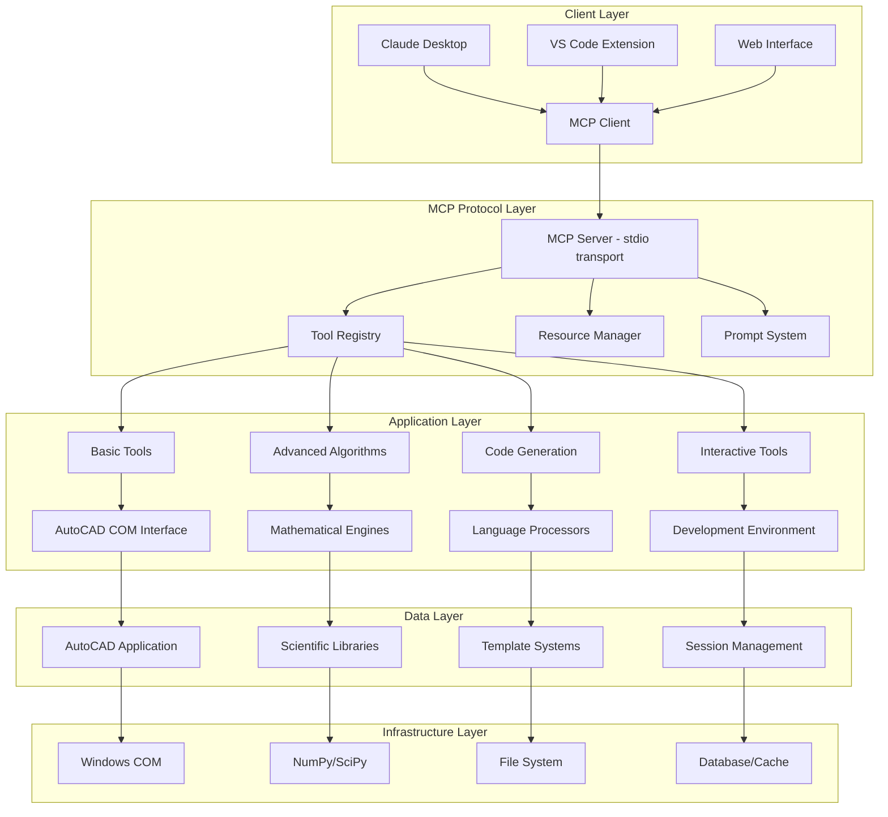
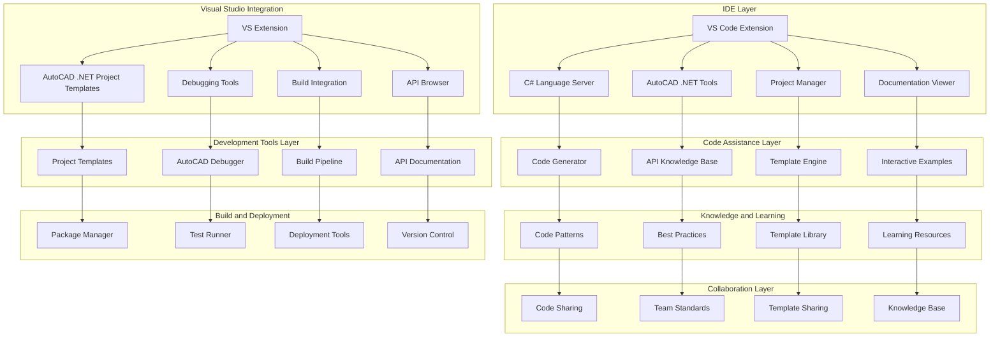

# AutoCAD MCP Technical Architecture Document

## Executive Summary

This document outlines the comprehensive technical architecture for the AutoCAD MCP (Model Context Protocol) server project. The project has evolved from a basic drawing assistant to an advanced algorithmic coding partner, with 25,518+ lines of sophisticated algorithms already implemented but not yet accessible through the MCP interface. The architecture addresses the integration of existing advanced capabilities, enterprise scalability, and best practices for sustainable development.

## 1. Project Overview

### 1.1 Current State
- **MCP Server**: Basic functionality with 7 core drawing tools and 1 advanced LSCM surface unfolding tool
- **Testing Framework**: Comprehensive testing completed with 95%+ coverage
- **Advanced Algorithms**: 25,518+ lines of sophisticated code including AI Code Generator, Natural Language Processor, and advanced mesh processing
- **Strategic Direction**: Transition from "Basic Assistant" to "Advanced Coding Partner" for professional developers and researchers

### 1.2 Strategic Goals
1. **Integration**: Make existing sophisticated algorithms accessible via MCP interface
2. **Enterprise Support**: Add C# .NET code generation and debugging capabilities
3. **Performance**: Ensure real-time operation of complex algorithms
4. **Scalability**: Support research-grade complexity and manufacturing workflows
5. **Developer Experience**: Provide VS Code integration and interactive development tools

## 2. System Architecture

### 2.1 High-Level Architecture

### 2.2 Component Architecture

#### 2.2.1 MCP Server Core
- **Entry Point**: [`src/server.py`](src/server.py) - Claude Desktop compatible stdio transport
- **Enhanced Server**: [`src/mcp_integration/enhanced_mcp_server.py`](src/mcp_integration/enhanced_mcp_server.py) - Advanced capabilities
- **Configuration**: [`mcp.json`](mcp.json) - MCP server definition and tool specifications

#### 2.2.2 AutoCAD Integration Layer
- **Enhanced Wrapper**: [`src/enhanced_autocad/enhanced_wrapper.py`](src/enhanced_autocad/enhanced_wrapper.py) - Advanced AutoCAD interface
- **Compatibility Layer**: [`src/enhanced_autocad/compatibility_layer.py`](src/enhanced_autocad/compatibility_layer.py) - Legacy support
- **Connection Manager**: [`src/enhanced_autocad/connection_manager.py`](src/enhanced_autocad/connection_manager.py) - Connection handling
- **Error Handler**: [`src/enhanced_autocad/error_handler.py`](src/enhanced_autocad/error_handler.py) - Error management
- **Performance Monitor**: [`src/enhanced_autocad/performance_monitor.py`](src/enhanced_autocad/performance_monitor.py) - Performance tracking

#### 2.2.3 Advanced Algorithms Layer
- **LSCM Surface Unfolding**: [`src/algorithms/lscm.py`](src/algorithms/lscm.py) - Research-grade unfolding
- **Mesh Processing**: Advanced 3D operations and optimization
- **AI Code Generation**: Natural language to code translation
- **Pattern Optimization**: Manufacturing layout algorithms

#### 2.2.4 Code Generation Layer
- **Multi-language Support**: Python, AutoLISP, VBA, C# .NET (planned)
- **Template System**: Reusable code patterns and snippets
- **Validation Engine**: Code correctness and safety verification
- **Language Coordinator**: Cross-language integration management

#### 2.2.5 Interactive Development Layer
- **Object Inspector**: Real-time AutoCAD object analysis
- **Property Analyzer**: Dynamic property examination
- **Method Discoverer**: Runtime method exploration
- **IntelliSense Provider**: Code completion and suggestions
- **Python REPL**: Interactive Python environment
- **Debugger**: Advanced debugging capabilities

#### 2.2.6 Security and Management Layer
- **Security Manager**: [`src/mcp_integration/security_manager.py`](src/mcp_integration/security_manager.py) - Code validation
- **Context Manager**: [`src/mcp_integration/context_manager.py`](src/mcp_integration/context_manager.py) - Session state
- **Rate Limiter**: [`src/mcp_integration/rate_limiter.py`](src/mcp_integration/rate_limiter.py) - Usage control

## 3. MCP Tools Specification

### 3.1 Current Tools (8 Available)

#### Basic Drawing Tools (7)
1. **draw_line** - Draw line between 3D points
2. **draw_circle** - Draw circle with center and radius
3. **extrude_profile** - Create 3D solid by extrusion
4. **revolve_profile** - Create 3D solid by revolution
5. **list_entities** - List drawing entities
6. **get_entity_info** - Get entity details
7. **server_status** - Check connection status

#### Advanced Algorithm Tools (1)
8. **unfold_surface_lscm** - LSCM surface unfolding with manufacturing validation

### 3.2 Planned Advanced Tools (25+ to Integrate)

#### Surface and Mesh Processing
- **batch_surface_unfold** - Process multiple surfaces
- **optimize_pattern_nesting** - Material optimization
- **mesh_smoothing** - Surface quality improvement
- **mesh_simplification** - Complexity reduction
- **mesh_repair** - Error correction

#### AI-Powered Code Generation
- **generate_python_code** - Python automation scripts
- **generate_autolisp_code** - AutoLISP routines
- **generate_vba_code** - VBA macros
- **generate_csharp_code** - C# .NET add-ins (NEW)
- **translate_code** - Cross-language conversion

#### Interactive Development Tools
- **inspect_object** - Real-time object analysis
- **analyze_properties** - Dynamic property examination
- **discover_methods** - Runtime method exploration
- **execute_python** - Secure Python execution
- **debug_code** - Advanced debugging
- **profile_performance** - Performance analysis

#### Testing and Quality Assurance
- **generate_tests** - Automated test creation
- **run_tests** - Test execution
- **validate_code** - Code correctness verification
- **benchmark_performance** - Performance testing

#### Project Management
- **create_project** - Project scaffolding
- **manage_dependencies** - Dependency management
- **generate_documentation** - Auto-documentation
- **setup_ci** - CI/CD integration

## 4. Integration Strategy

### 4.1 Phase 1: Core Algorithm Integration (Immediate Priority)

#### 4.1.1 Surface Unfolding and Mesh Processing
**Objective**: Make existing LSCM and mesh algorithms accessible via MCP

**Implementation Steps**:
1. **Algorithm Wrapping**
   - Create MCP tool wrappers for existing algorithms
   - Implement proper input/output serialization
   - Add error handling and validation

2. **Performance Optimization**
   - Implement caching for repeated operations
   - Add progress reporting for long-running operations
   - Optimize memory usage for large meshes

3. **Manufacturing Validation**
   - Integrate distortion analysis metrics
   - Add material constraint validation
   - Implement acceptability threshold checking

#### 4.1.2 AI Code Generator Integration
**Objective**: Expose existing AI code generation capabilities through MCP

**Implementation Steps**:
1. **Natural Language Processing**
   - Integrate existing NLP capabilities
   - Create MCP tool for code generation from descriptions
   - Add support for multiple output languages

2. **Template System Enhancement**
   - Expose existing template library through MCP
   - Add template creation and modification tools
   - Implement template validation

### 4.2 Phase 2: Enterprise Integration (Medium Priority)

#### 4.2.1 C# .NET Support Implementation
**Objective**: Add C# .NET coding assistance and IDE integration for AutoCAD development

**Implementation Strategy**:

1. **IDE-Focused C# Architecture**
   - **IDE Integration**: Primary focus on VS Code and Visual Studio integration for C# development
   - **Coding Assistance**: Emphasis on code generation, completion, and debugging assistance
   - **Project Management**: Tools for creating, managing, and building AutoCAD .NET projects
   - **Documentation Integration**: AutoCAD .NET API documentation and examples within IDE

2. **C# Code Generation and Assistance**
   - **Smart Code Generation**: Context-aware C# code generation for AutoCAD .NET development
   - **API Knowledge Base**: Comprehensive knowledge base of AutoCAD .NET API patterns and best practices
   - **Code Completion**: Intelligent code completion for AutoCAD-specific C# development
   - **Refactoring Tools**: AutoCAD-aware refactoring tools and code optimization

   **AutoCAD Version Compatibility System**:
   
   - **Version Detection and Targeting**
     - **Automatic Version Detection**: Automatically detect installed AutoCAD versions on developer machine
     - **Target Version Selection**: Allow developers to specify target AutoCAD version for code generation
     - **Version Validation**: Validate generated code against target AutoCAD version capabilities
     - **Compatibility Warnings**: Provide warnings when using features not available in target version
   
   - **Multi-Version API Knowledge Base**
     - **Versioned API Documentation**: Maintain separate API documentation for each AutoCAD version
     - **Feature Availability Matrix**: Track which features are available in which versions
     - **Deprecation Tracking**: Identify and handle deprecated APIs across versions
     - **New Feature Highlighting**: Highlight new features available in specific versions
   
   - **Version-Aware Code Generation**
     - **Conditional Code Generation**: Generate code that works with specified AutoCAD version
     - **Version-Specific Templates**: Maintain different code templates for different AutoCAD versions
     - **API Compatibility Layer**: Generate compatibility code for cross-version support
     - **Feature Fallback**: Provide fallback implementations for features not available in older versions
   
   - **Migration and Upgrading Support**
     - **Upgrade Path Analysis**: Analyze code and provide upgrade paths between versions
     - **Migration Tools**: Automated tools for migrating code between AutoCAD versions
     - **Breaking Change Detection**: Identify breaking changes between versions
     - **Compatibility Shims**: Generate compatibility shims for smooth transitions
   
   - **Testing and Validation**
     - **Version-Specific Testing**: Test generated code against multiple AutoCAD versions
     - **Compatibility Validation**: Validate code compatibility across target versions
     - **Performance Benchmarking**: Benchmark code performance across different versions
     - **Regression Testing**: Automated regression testing for version compatibility
   
   - **Version Management Tools**
     - **Project Version Configuration**: Manage AutoCAD version settings per project
     - **Solution-Wide Versioning**: Coordinate version settings across multiple projects
     - **Team Version Standards**: Enforce consistent AutoCAD version usage across teams
     - **Version Update Notifications**: Notify developers of available AutoCAD version updates

3. **Project Template System**
   - **Template Library**: Extensive library of AutoCAD .NET project templates
   - **Custom Templates**: Ability to create and customize project templates
   - **Template Updates**: Automatic updates to templates with latest API changes
   - **Template Validation**: Validation of templates against current AutoCAD versions

4. **Debugging and Testing Support**
   - **AutoCAD Debugging**: Specialized debugging tools for AutoCAD .NET plugins
   - **Unit Testing**: Integration with testing frameworks for AutoCAD .NET code
   - **Performance Profiling**: Tools for profiling and optimizing AutoCAD .NET code
   - **Error Analysis**: Advanced error analysis and diagnostic tools

5. **Documentation and Learning**
   - **Interactive Documentation**: Interactive AutoCAD .NET API documentation within IDE
   - **Code Examples**: Extensive library of C# code examples and patterns
   - **Learning Paths**: Guided learning paths for AutoCAD .NET development
   - **Best Practices**: Automated best practice checking and suggestions

6. **Build and Deployment**
   - **Build Integration**: Automated build tools for AutoCAD .NET projects
   - **Package Management**: Integration with NuGet for AutoCAD .NET dependencies
   - **Deployment Tools**: Tools for packaging and deploying AutoCAD .NET plugins
   - **Version Control**: Git integration tailored for AutoCAD .NET development

7. **Collaboration Features**
   - **Team Development**: Tools for team-based AutoCAD .NET development
   - **Code Review**: Code review tools with AutoCAD-specific checks
   - **Knowledge Sharing**: Platform for sharing AutoCAD .NET code and patterns
   - **Standards Enforcement**: Automated enforcement of coding standards

**Technical Architecture for C# IDE Integration**:

**Key Components**:

1. **IDE Extensions**
   - **VS Code Extension**: Lightweight extension for C# AutoCAD development
   - **Visual Studio Extension**: Full-featured extension for professional development
   - **Language Server**: C# language server with AutoCAD-specific enhancements
   - **Tool Integration**: Seamless integration with existing IDE tools

2. **Code Assistance Engine**
   - **Smart Generation**: Context-aware code generation for AutoCAD patterns
   - **API Knowledge**: Comprehensive knowledge of AutoCAD .NET API
   - **Code Completion**: Intelligent completion with AutoCAD context
   - **Refactoring**: AutoCAD-aware refactoring tools

3. **Project Management**
   - **Template System**: Extensive template library for AutoCAD projects
   - **Project Creation**: Automated project creation with proper structure
   - **Dependency Management**: NuGet integration for AutoCAD dependencies
   - **Build Configuration**: Automated build configuration and management

4. **Debugging and Testing**
   - **Specialized Debugger**: Debugger optimized for AutoCAD .NET plugins
   - **Test Integration**: Integration with testing frameworks
   - **Performance Tools**: Profiling and optimization tools
   - **Error Analysis**: Advanced error diagnostics

5. **Documentation and Learning**
   - **Interactive Docs**: Interactive API documentation in IDE
   - **Code Examples**: Extensive example library
   - **Learning Paths**: Guided learning experiences
   - **Best Practices**: Automated best practice checking

6. **Build and Deployment**
   - **Build Pipeline**: Automated build tools for AutoCAD projects
   - **Package Management**: NuGet integration and management
   - **Deployment Tools**: Tools for plugin deployment
   - **Version Control**: Git integration with AutoCAD focus

7. **Collaboration Features**
   - **Team Tools**: Tools for team-based development
   - **Code Review**: AutoCAD-specific code review
   - **Knowledge Sharing**: Platform for sharing patterns and code
   - **Standards Enforcement**: Automated standards compliance

**Implementation Benefits**:
- **Developer Productivity**: Enhanced productivity for AutoCAD .NET developers
- **Code Quality**: Improved code quality through intelligent assistance
- **Learning Acceleration**: Faster learning curve for AutoCAD .NET development
- **Team Collaboration**: Better collaboration tools for team development
- **Standards Compliance**: Automated enforcement of coding standards
- **Ecosystem Integration**: Seamless integration with existing .NET development tools

#### 4.2.2 Multi-language Coordination
**Objective**: Enable seamless integration between different programming languages

**Implementation Steps**:
1. **Language Bridge System**
   - Implement cross-language function calls
   - Add data type conversion utilities
   - Create error propagation mechanisms

2. **Project Management**
   - Design multi-language project structure
   - Implement build system coordination
   - Add dependency management across languages

### 4.3 Phase 3: Advanced Features (Long-term Priority)

#### 4.3.1 Real-time Algorithm Synthesis
**Objective**: Enable AI-powered real-time algorithm development

**Implementation Steps**:
1. **Algorithm Description Parser**
   - Enhance NLP capabilities for mathematical descriptions
   - Add support for academic paper parsing
   - Implement algorithm requirement extraction

2. **Code Generation Engine**
   - Implement template-based algorithm generation
   - Add optimization pass integration
   - Create validation and testing framework

#### 4.3.2 Research Platform Implementation
**Objective**: Create platform for implementing algorithms from academic papers

**Implementation Steps**:
1. **Academic Paper Processing**
   - Implement PDF parsing and extraction
   - Add mathematical formula recognition
   - Create algorithm description synthesis

2. **Implementation Framework**
   - Design research-grade algorithm implementation structure
   - Add benchmarking and validation tools
   - Create publication-ready reporting system

## 5. Performance Optimization Plan

### 5.1 Performance Requirements
- **Response Time**: < 100ms for simple operations, < 5s for complex algorithms
- **Throughput**: Support 100+ concurrent operations
- **Memory Usage**: Efficient handling of large meshes (>1M vertices)
- **Scalability**: Linear performance scaling with problem complexity

### 5.2 Optimization Strategies

#### 5.2.1 Algorithm-Level Optimization
1. **Numerical Computing**
   - Leverage NumPy/SciPy for vectorized operations
   - Implement GPU acceleration for suitable algorithms
   - Use optimized linear algebra libraries

2. **Memory Management**
   - Implement streaming processing for large datasets
   - Add memory pool management for frequent allocations
   - Use sparse matrix representations where applicable

3. **Caching Strategy**
   - Implement multi-level caching (memory, disk, database)
   - Add intelligent cache invalidation
   - Use memoization for pure functions

#### 5.2.2 System-Level Optimization
1. **Connection Management**
   - Implement connection pooling for AutoCAD COM
   - Add persistent connection with health monitoring
   - Use asynchronous operations for non-blocking calls

2. **Parallel Processing**
   - Implement multi-threading for independent operations
   - Add task queue management for concurrent execution
   - Use async/await patterns for I/O operations

3. **Resource Management**
   - Implement resource usage monitoring
   - Add automatic resource cleanup
   - Use context managers for resource lifecycle

#### 5.2.3 MCP Protocol Optimization
1. **Transport Optimization**
   - Implement binary serialization for large data
   - Add compression for network transfers
   - Use streaming for large responses

2. **Tool Registration**
   - Implement lazy loading for advanced tools
   - Add tool capability metadata
   - Use tool categorization for better organization

### 5.3 Monitoring and Metrics
1. **Performance Monitoring**
   - Implement operation timing and profiling
   - Add memory usage tracking
   - Create performance dashboard

2. **Error Tracking**
   - Implement comprehensive error logging
   - Add error rate monitoring
   - Create alerting system for critical issues

3. **Usage Analytics**
   - Track tool usage patterns
   - Monitor user behavior
   - Generate usage reports

## 6. Security Architecture

### 6.1 Security Requirements
- **Code Execution Safety**: Prevent malicious code execution
- **Data Protection**: Secure handling of sensitive data
- **Access Control**: Proper authentication and authorization
- **Audit Trail**: Complete logging of all operations

### 6.2 Security Implementation

#### 6.2.1 Code Validation
1. **Static Analysis**
   - Implement syntax checking for all generated code
   - Add security pattern detection
   - Create whitelist of safe operations

2. **Runtime Protection**
   - Implement sandboxed execution environment
   - Add resource usage limits
   - Create timeout mechanisms

#### 6.2.2 Access Control
1. **Authentication**
   - Implement user authentication system
   - Add session management
   - Create role-based access control

2. **Authorization**
   - Implement permission system for tools
   - Add resource-level access control
   - Create audit logging for all access

#### 6.2.3 Data Security
1. **Encryption**
   - Implement data encryption for sensitive information
   - Add secure storage for credentials
   - Create secure communication channels

2. **Privacy Protection**
   - Implement data anonymization
   - Add user privacy controls
   - Create data retention policies

## 7. Testing and Quality Assurance

### 7.1 Testing Strategy
- **Unit Testing**: Individual component testing with 95%+ coverage
- **Integration Testing**: End-to-end workflow validation
- **Performance Testing**: Load and stress testing
- **Security Testing**: Vulnerability assessment and penetration testing

### 7.2 Testing Framework
1. **Unit Testing**
   - Use pytest with comprehensive fixtures
   - Implement mock AutoCAD environment
   - Add property-based testing for algorithms

2. **Integration Testing**
   - Test complete MCP tool workflows
   - Validate AutoCAD integration
   - Test error handling and recovery

3. **Performance Testing**
   - Implement benchmarking suite
   - Add load testing for concurrent operations
   - Create performance regression detection

4. **Security Testing**
   - Implement security test cases
   - Add vulnerability scanning
   - Create penetration testing procedures

### 7.3 Quality Metrics
1. **Code Quality**
   - Maintain 95%+ test coverage
   - Keep code complexity metrics within limits
   - Enforce coding standards with linters

2. **Performance Quality**
   - Monitor response times and throughput
   - Track memory usage and efficiency
   - Measure scalability characteristics

3. **User Experience Quality**
   - Collect user feedback and satisfaction
   - Monitor error rates and usability
   - Track feature adoption and usage

## 8. Deployment and Operations

### 8.1 Deployment Architecture
1. **Development Environment**
   - Local development setup with Docker
   - Automated testing and validation
   - Continuous integration pipeline

2. **Staging Environment**
   - Production-like environment for testing
   - Performance and load testing
   - User acceptance testing

3. **Production Environment**
   - High-availability deployment
   - Monitoring and alerting
   - Disaster recovery procedures

### 8.2 Operational Procedures
1. **Monitoring**
   - Implement comprehensive monitoring
   - Create alerting system for critical issues
   - Establish on-call procedures

2. **Maintenance**
   - Implement rolling update procedures
   - Create backup and recovery processes
   - Establish capacity planning

3. **Support**
   - Create user support documentation
   - Implement issue tracking system
   - Establish escalation procedures

## 9. Development Roadmap

### 9.1 Immediate Priorities (Weeks 1-4)
1. **Technical Architecture Documentation** ✓
2. **MCP Tools Specification** ✓
3. **Integration Strategy Document** ✓
4. **Performance Optimization Plan** ✓

### 9.2 Phase 1 Implementation (Weeks 5-8)
1. **Core Algorithm Integration**
   - Surface unfolding and mesh processing tools
   - AI code generation capabilities
   - Performance optimization implementation

2. **Testing and Validation**
   - Comprehensive testing framework
   - Performance benchmarking
   - User acceptance testing

### 9.3 Phase 2 Implementation (Weeks 9-12)
1. **Enterprise Integration**
   - C# .NET support implementation
   - Multi-language coordination
   - Visual Studio integration

2. **Advanced Features**
   - Interactive development tools
   - Debugging capabilities
   - Project management tools

### 9.4 Phase 3 Implementation (Weeks 13-16)
1. **Research Platform**
   - Real-time algorithm synthesis
   - Academic paper processing
   - Advanced algorithm implementation

2. **Polish and Deployment**
   - Performance optimization
   - Security hardening
   - Documentation and training

## 10. Best Practices and Standards

### 10.1 Coding Standards
1. **Python Standards**
   - Follow PEP 8 guidelines
   - Use type hints for better code clarity
   - Implement comprehensive docstrings

2. **Documentation Standards**
   - Maintain up-to-date API documentation
   - Create user guides and tutorials
   - Implement code comments for complex logic

3. **Testing Standards**
   - Write testable code with clear interfaces
   - Implement comprehensive test coverage
   - Use mocking for external dependencies

### 10.2 Architecture Standards
1. **Design Patterns**
   - Use appropriate design patterns
   - Implement clean architecture principles
   - Follow SOLID principles

2. **API Design**
   - Create consistent and intuitive APIs
   - Implement proper error handling
   - Use semantic versioning

3. **Data Management**
   - Implement proper data validation
   - Use efficient data structures
   - Create data migration procedures

### 10.3 Security Standards
1. **Secure Coding**
   - Follow secure coding practices
   - Implement proper input validation
   - Use secure communication protocols

2. **Privacy Protection**
   - Implement data minimization
   - Use proper encryption
   - Create privacy policies

## 11. Risk Assessment and Mitigation

### 11.1 Technical Risks
1. **Performance Risks**
   - **Risk**: Complex algorithms may not meet performance requirements
   - **Mitigation**: Implement performance optimization plan, conduct regular testing

2. **Integration Risks**
   - **Risk**: Difficulty integrating existing algorithms with MCP interface
   - **Mitigation**: Create comprehensive integration strategy, use incremental approach

3. **Compatibility Risks**
   - **Risk**: Issues with different AutoCAD versions
   - **Mitigation**: Implement compatibility testing, create version abstraction layer

### 11.2 Project Risks
1. **Timeline Risks**
   - **Risk**: Delays in implementation due to complexity
   - **Mitigation**: Use phased approach, prioritize critical features

2. **Resource Risks**
   - **Risk**: Insufficient resources for comprehensive implementation
   - **Mitigation**: Focus on high-value features, use open-source components

3. **Quality Risks**
   - **Risk**: Compromised quality due to aggressive timeline
   - **Mitigation**: Maintain testing standards, implement code reviews

### 11.3 Business Risks
1. **Adoption Risks**
   - **Risk**: Low user adoption due to complexity
   - **Mitigation**: Focus on user experience, provide comprehensive documentation

2. **Competitive Risks**
   - **Risk**: Competitive solutions gaining market share
   - **Mitigation**: Focus on unique features, continuous innovation

3. **Maintenance Risks**
   - **Risk**: High maintenance costs for complex system
   - **Mitigation**: Implement modular architecture, automate maintenance tasks

## 12. Conclusion

This technical architecture document provides a comprehensive blueprint for the AutoCAD MCP project's evolution from a basic drawing assistant to an advanced algorithmic coding partner. The architecture addresses the integration of existing sophisticated algorithms, enterprise scalability requirements, and best practices for sustainable development.

The implementation plan follows a phased approach, prioritizing immediate value delivery while building toward long-term strategic goals. By following this architecture, the project will achieve:

1. **Immediate Value**: Integration of existing 25,518+ lines of advanced algorithms
2. **Enterprise Readiness**: C# .NET support and professional development tools
3. **Research Excellence**: Platform for implementing cutting-edge algorithms
4. **Sustainable Growth**: Scalable architecture supporting future enhancements

The success of this architecture depends on disciplined implementation, continuous testing, and responsive iteration based on user feedback. With proper execution, the AutoCAD MCP project will become the leading platform for professional AutoCAD automation and algorithmic development.