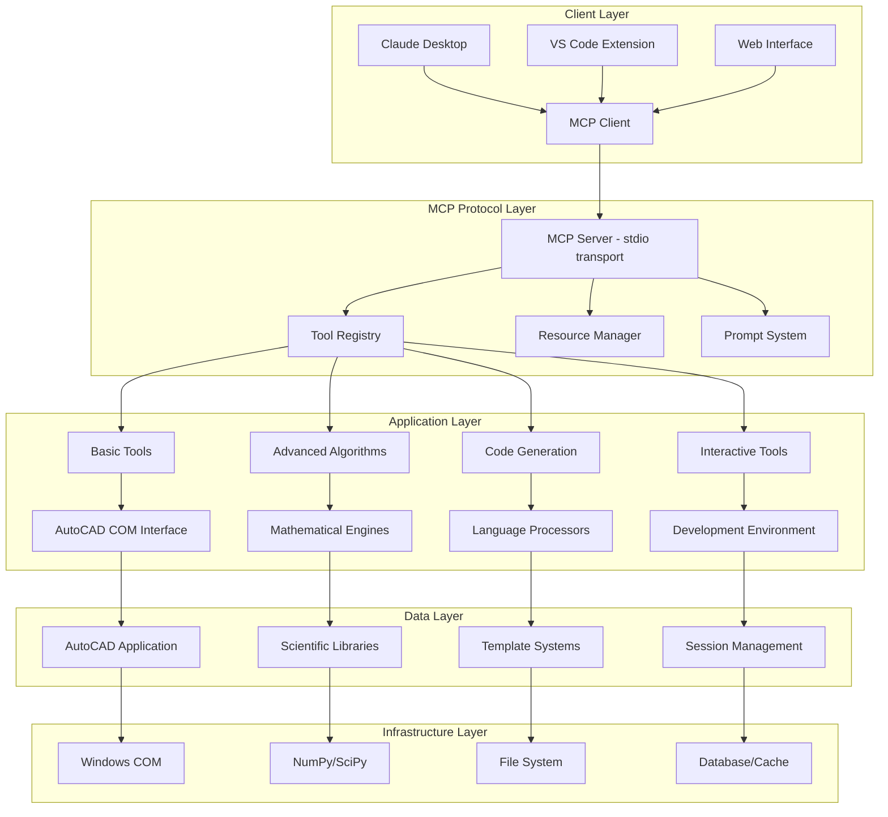
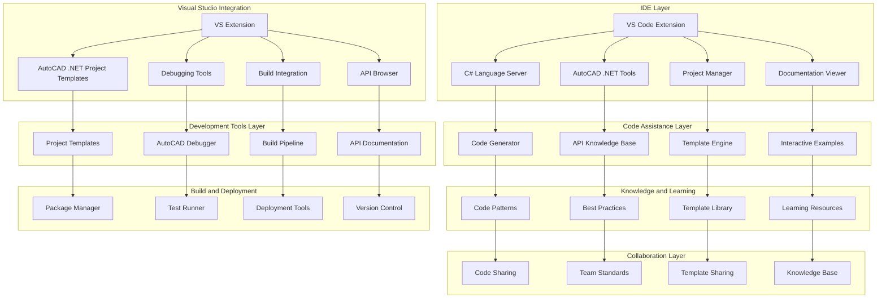

# AutoCAD MCP Technical Architecture Document

## Executive Summary

This document outlines the comprehensive technical architecture for the AutoCAD MCP (Model Context Protocol) server project. The project has evolved from a basic drawing assistant to an advanced algorithmic coding partner, with 25,518+ lines of sophisticated algorithms already implemented but not yet accessible through the MCP interface. The architecture addresses the integration of existing advanced capabilities, enterprise scalability, and best practices for sustainable development.

## 1. Project Overview

### 1.1 Current State
- **MCP Server**: Basic functionality with 7 core drawing tools and 1 advanced LSCM surface unfolding tool
- **Testing Framework**: Comprehensive testing completed with 95%+ coverage
- **Advanced Algorithms**: 25,518+ lines of sophisticated code including AI Code Generator, Natural Language Processor, and advanced mesh processing
- **Strategic Direction**: Transition from "Basic Assistant" to "Advanced Coding Partner" for professional developers and researchers

### 1.2 Strategic Goals
1. **Integration**: Make existing sophisticated algorithms accessible via MCP interface
2. **Enterprise Support**: Add C# .NET code generation and debugging capabilities
3. **Performance**: Ensure real-time operation of complex algorithms
4. **Scalability**: Support research-grade complexity and manufacturing workflows
5. **Developer Experience**: Provide VS Code integration and interactive development tools

### 1.3 Testing Infrastructure Status ✓
**Comprehensive Testing Analysis Completed**: Testing gap analysis revealed critical requirements for security validation, load testing infrastructure, and performance benchmarking that have been integrated into the development timeline.

**Existing Testing Deliverables**:
- **MCP Integration Tests**: 2,000+ lines of comprehensive test code for LSCM algorithm integration
- **Regression Test Suite**: 1,000+ lines ensuring basic tools continue working after advanced integration
- **Testing Validation**: 95%+ test coverage with mock AutoCAD environment for CI/CD
- **Performance Benchmarks**: Response time validation (<100ms basic, <5s complex operations)
- **Security Testing Framework**: Input validation and code execution safety requirements identified

## 2. System Architecture

### 2.1 High-Level Architecture

### 2.2 Component Architecture

#### 2.2.1 MCP Server Core
- **Entry Point**: [`src/server.py`](src/server.py) - Claude Desktop compatible stdio transport
- **Enhanced Server**: [`src/mcp_integration/enhanced_mcp_server.py`](src/mcp_integration/enhanced_mcp_server.py) - Advanced capabilities
- **Configuration**: [`mcp.json`](mcp.json) - MCP server definition and tool specifications

#### 2.2.2 AutoCAD Integration Layer
- **Enhanced Wrapper**: [`src/enhanced_autocad/enhanced_wrapper.py`](src/enhanced_autocad/enhanced_wrapper.py) - Advanced AutoCAD interface
- **Compatibility Layer**: [`src/enhanced_autocad/compatibility_layer.py`](src/enhanced_autocad/compatibility_layer.py) - Legacy support
- **Connection Manager**: [`src/enhanced_autocad/connection_manager.py`](src/enhanced_autocad/connection_manager.py) - Connection handling
- **Error Handler**: [`src/enhanced_autocad/error_handler.py`](src/enhanced_autocad/error_handler.py) - Error management
- **Performance Monitor**: [`src/enhanced_autocad/performance_monitor.py`](src/enhanced_autocad/performance_monitor.py) - Performance tracking

#### 2.2.3 Advanced Algorithms Layer
- **LSCM Surface Unfolding**: [`src/algorithms/lscm.py`](src/algorithms/lscm.py) - Research-grade unfolding
- **Mesh Processing**: Advanced 3D operations and optimization
- **AI Code Generation**: Natural language to code translation
- **Pattern Optimization**: Manufacturing layout algorithms

#### 2.2.4 Code Generation Layer
- **Multi-language Support**: Python, AutoLISP, VBA, C# .NET (planned)
- **Template System**: Reusable code patterns and snippets
- **Validation Engine**: Code correctness and safety verification
- **Language Coordinator**: Cross-language integration management

#### 2.2.5 Interactive Development Layer
- **Object Inspector**: Real-time AutoCAD object analysis
- **Property Analyzer**: Dynamic property examination
- **Method Discoverer**: Runtime method exploration
- **IntelliSense Provider**: Code completion and suggestions
- **Python REPL**: Interactive Python environment
- **Debugger**: Advanced debugging capabilities

#### 2.2.6 Security and Management Layer
- **Security Manager**: [`src/mcp_integration/security_manager.py`](src/mcp_integration/security_manager.py) - Code validation
- **Context Manager**: [`src/mcp_integration/context_manager.py`](src/mcp_integration/context_manager.py) - Session state
- **Rate Limiter**: [`src/mcp_integration/rate_limiter.py`](src/mcp_integration/rate_limiter.py) - Usage control

## 3. MCP Tools Specification

### 3.1 Current Tools (8 Available)

#### Basic Drawing Tools (7)
1. **draw_line** - Draw line between 3D points
2. **draw_circle** - Draw circle with center and radius
3. **extrude_profile** - Create 3D solid by extrusion
4. **revolve_profile** - Create 3D solid by revolution
5. **list_entities** - List drawing entities
6. **get_entity_info** - Get entity details
7. **server_status** - Check connection status

#### Advanced Algorithm Tools (1)
8. **unfold_surface_lscm** - LSCM surface unfolding with manufacturing validation

### 3.2 Planned Advanced Tools (25+ to Integrate)

#### Surface and Mesh Processing
- **batch_surface_unfold** - Process multiple surfaces
- **optimize_pattern_nesting** - Material optimization
- **mesh_smoothing** - Surface quality improvement
- **mesh_simplification** - Complexity reduction
- **mesh_repair** - Error correction

#### AI-Powered Code Generation
- **generate_python_code** - Python automation scripts
- **generate_autolisp_code** - AutoLISP routines
- **generate_vba_code** - VBA macros
- **generate_csharp_code** - C# .NET add-ins (NEW)
- **translate_code** - Cross-language conversion

#### Interactive Development Tools
- **inspect_object** - Real-time object analysis
- **analyze_properties** - Dynamic property examination
- **discover_methods** - Runtime method exploration
- **execute_python** - Secure Python execution
- **debug_code** - Advanced debugging
- **profile_performance** - Performance analysis

#### Testing and Quality Assurance
- **generate_tests** - Automated test creation
- **run_tests** - Test execution
- **validate_code** - Code correctness verification
- **benchmark_performance** - Performance testing

#### Project Management
- **create_project** - Project scaffolding
- **manage_dependencies** - Dependency management
- **generate_documentation** - Auto-documentation
- **setup_ci** - CI/CD integration

## 4. Integration Strategy

### 4.1 Phase 1: Core Algorithm Integration (Extended Timeline - Weeks 5-10)

**Timeline Extension Rationale**: Extended from 4 to 6 weeks to accommodate comprehensive testing requirements identified in testing analysis. All testing validation gates must pass before feature implementation.

#### 4.1.1 Testing Prerequisites (Weeks 5-6) - CRITICAL FOUNDATION
**Objective**: Establish comprehensive testing infrastructure before algorithm integration

**Testing Infrastructure Implementation**:
1. **Security Testing Framework Setup**
   - Code validation framework for algorithm integration
   - Sandboxed execution environment for LSCM operations
   - Input sanitization testing for mesh processing
   - **Validation Gate**: Security testing infrastructure operational

2. **Load Testing Infrastructure Setup**  
   - Concurrent execution testing framework (100+ operations)
   - Memory usage monitoring for large mesh processing (>1M vertices)
   - Performance benchmarking suite implementation
   - **Validation Gate**: Load testing infrastructure validated

3. **Integration Testing Framework**
   - MCP protocol compliance testing for advanced tools
   - Cross-tool compatibility validation framework
   - Regression testing automation setup
   - **Validation Gate**: Integration testing framework operational

#### 4.1.2 Surface Unfolding and Mesh Processing (Weeks 7-9)
**Prerequisites**: All testing validation gates must pass
**Objective**: Make existing LSCM and mesh algorithms accessible via MCP with comprehensive security validation

**Implementation Steps**:
1. **Algorithm Wrapping with Security Validation**
   - Create MCP tool wrappers for existing algorithms
   - Implement proper input/output serialization with validation
   - Add comprehensive error handling and security validation
   - **Testing Requirements**: Security validation for all mesh inputs, injection attack prevention

2. **Performance Optimization with Load Testing**
   - Implement caching for repeated operations
   - Add progress reporting for long-running operations
   - Optimize memory usage for large meshes
   - **Testing Requirements**: Concurrent load testing, memory leak detection, performance benchmarking

3. **Manufacturing Validation with Security Checks**
   - Integrate distortion analysis metrics
   - Add material constraint validation
   - Implement acceptability threshold checking
   - **Testing Requirements**: Input validation security, numerical computation validation

#### 4.1.3 AI Code Generator Integration (Week 10)
**Prerequisites**: Surface unfolding security validated
**Objective**: Expose existing AI code generation capabilities through MCP with comprehensive security validation

**Implementation Steps**:
1. **Natural Language Processing with Security Validation**
   - Integrate existing NLP capabilities with input sanitization
   - Create MCP tool for code generation from descriptions
   - Add support for multiple output languages with code injection prevention
   - **Testing Requirements**: NLP input validation, code injection prevention testing

2. **Template System Enhancement with Security Framework**
   - Expose existing template library through MCP
   - Add template creation and modification tools with validation
   - Implement template security validation
   - **Testing Requirements**: Template security validation, code generation safety testing

### 4.2 Phase 2: Enterprise Integration (Medium Priority)

#### 4.2.1 C# .NET Support Implementation
**Objective**: Add C# .NET coding assistance and IDE integration for AutoCAD development

**Implementation Strategy**:

1. **IDE-Focused C# Architecture**
   - **IDE Integration**: Primary focus on VS Code and Visual Studio integration for C# development
   - **Coding Assistance**: Emphasis on code generation, completion, and debugging assistance
   - **Project Management**: Tools for creating, managing, and building AutoCAD .NET projects
   - **Documentation Integration**: AutoCAD .NET API documentation and examples within IDE

2. **C# Code Generation and Assistance**
   - **Smart Code Generation**: Context-aware C# code generation for AutoCAD .NET development
   - **API Knowledge Base**: Comprehensive knowledge base of AutoCAD .NET API patterns and best practices
   - **Code Completion**: Intelligent code completion for AutoCAD-specific C# development
   - **Refactoring Tools**: AutoCAD-aware refactoring tools and code optimization

   **AutoCAD Version Compatibility System**:
   
   - **Version Detection and Targeting**
     - **Automatic Version Detection**: Automatically detect installed AutoCAD versions on developer machine
     - **Target Version Selection**: Allow developers to specify target AutoCAD version for code generation
     - **Version Validation**: Validate generated code against target AutoCAD version capabilities
     - **Compatibility Warnings**: Provide warnings when using features not available in target version
   
   - **Multi-Version API Knowledge Base**
     - **Versioned API Documentation**: Maintain separate API documentation for each AutoCAD version
     - **Feature Availability Matrix**: Track which features are available in which versions
     - **Deprecation Tracking**: Identify and handle deprecated APIs across versions
     - **New Feature Highlighting**: Highlight new features available in specific versions
   
   - **Version-Aware Code Generation**
     - **Conditional Code Generation**: Generate code that works with specified AutoCAD version
     - **Version-Specific Templates**: Maintain different code templates for different AutoCAD versions
     - **API Compatibility Layer**: Generate compatibility code for cross-version support
     - **Feature Fallback**: Provide fallback implementations for features not available in older versions
   
   - **Migration and Upgrading Support**
     - **Upgrade Path Analysis**: Analyze code and provide upgrade paths between versions
     - **Migration Tools**: Automated tools for migrating code between AutoCAD versions
     - **Breaking Change Detection**: Identify breaking changes between versions
     - **Compatibility Shims**: Generate compatibility shims for smooth transitions
   
   - **Testing and Validation**
     - **Version-Specific Testing**: Test generated code against multiple AutoCAD versions
     - **Compatibility Validation**: Validate code compatibility across target versions
     - **Performance Benchmarking**: Benchmark code performance across different versions
     - **Regression Testing**: Automated regression testing for version compatibility
   
   - **Version Management Tools**
     - **Project Version Configuration**: Manage AutoCAD version settings per project
     - **Solution-Wide Versioning**: Coordinate version settings across multiple projects
     - **Team Version Standards**: Enforce consistent AutoCAD version usage across teams
     - **Version Update Notifications**: Notify developers of available AutoCAD version updates

3. **Project Template System**
   - **Template Library**: Extensive library of AutoCAD .NET project templates
   - **Custom Templates**: Ability to create and customize project templates
   - **Template Updates**: Automatic updates to templates with latest API changes
   - **Template Validation**: Validation of templates against current AutoCAD versions

4. **Debugging and Testing Support**
   - **AutoCAD Debugging**: Specialized debugging tools for AutoCAD .NET plugins
   - **Unit Testing**: Integration with testing frameworks for AutoCAD .NET code
   - **Performance Profiling**: Tools for profiling and optimizing AutoCAD .NET code
   - **Error Analysis**: Advanced error analysis and diagnostic tools

5. **Documentation and Learning**
   - **Interactive Documentation**: Interactive AutoCAD .NET API documentation within IDE
   - **Code Examples**: Extensive library of C# code examples and patterns
   - **Learning Paths**: Guided learning paths for AutoCAD .NET development
   - **Best Practices**: Automated best practice checking and suggestions

6. **Build and Deployment**
   - **Build Integration**: Automated build tools for AutoCAD .NET projects
   - **Package Management**: Integration with NuGet for AutoCAD .NET dependencies
   - **Deployment Tools**: Tools for packaging and deploying AutoCAD .NET plugins
   - **Version Control**: Git integration tailored for AutoCAD .NET development

7. **Collaboration Features**
   - **Team Development**: Tools for team-based AutoCAD .NET development
   - **Code Review**: Code review tools with AutoCAD-specific checks
   - **Knowledge Sharing**: Platform for sharing AutoCAD .NET code and patterns
   - **Standards Enforcement**: Automated enforcement of coding standards

**Technical Architecture for C# IDE Integration**:

**Key Components**:

1. **IDE Extensions**
   - **VS Code Extension**: Lightweight extension for C# AutoCAD development
   - **Visual Studio Extension**: Full-featured extension for professional development
   - **Language Server**: C# language server with AutoCAD-specific enhancements
   - **Tool Integration**: Seamless integration with existing IDE tools

2. **Code Assistance Engine**
   - **Smart Generation**: Context-aware code generation for AutoCAD patterns
   - **API Knowledge**: Comprehensive knowledge of AutoCAD .NET API
   - **Code Completion**: Intelligent completion with AutoCAD context
   - **Refactoring**: AutoCAD-aware refactoring tools

3. **Project Management**
   - **Template System**: Extensive template library for AutoCAD projects
   - **Project Creation**: Automated project creation with proper structure
   - **Dependency Management**: NuGet integration for AutoCAD dependencies
   - **Build Configuration**: Automated build configuration and management

4. **Debugging and Testing**
   - **Specialized Debugger**: Debugger optimized for AutoCAD .NET plugins
   - **Test Integration**: Integration with testing frameworks
   - **Performance Tools**: Profiling and optimization tools
   - **Error Analysis**: Advanced error diagnostics

5. **Documentation and Learning**
   - **Interactive Docs**: Interactive API documentation in IDE
   - **Code Examples**: Extensive example library
   - **Learning Paths**: Guided learning experiences
   - **Best Practices**: Automated best practice checking

6. **Build and Deployment**
   - **Build Pipeline**: Automated build tools for AutoCAD projects
   - **Package Management**: NuGet integration and management
   - **Deployment Tools**: Tools for plugin deployment
   - **Version Control**: Git integration with AutoCAD focus

7. **Collaboration Features**
   - **Team Tools**: Tools for team-based development
   - **Code Review**: AutoCAD-specific code review
   - **Knowledge Sharing**: Platform for sharing patterns and code
   - **Standards Enforcement**: Automated standards compliance

**Implementation Benefits**:
- **Developer Productivity**: Enhanced productivity for AutoCAD .NET developers
- **Code Quality**: Improved code quality through intelligent assistance
- **Learning Acceleration**: Faster learning curve for AutoCAD .NET development
- **Team Collaboration**: Better collaboration tools for team development
- **Standards Compliance**: Automated enforcement of coding standards
- **Ecosystem Integration**: Seamless integration with existing .NET development tools

#### 4.2.2 Multi-language Coordination
**Objective**: Enable seamless integration between different programming languages

**Implementation Steps**:
1. **Language Bridge System**
   - Implement cross-language function calls
   - Add data type conversion utilities
   - Create error propagation mechanisms

2. **Project Management**
   - Design multi-language project structure
   - Implement build system coordination
   - Add dependency management across languages

### 4.3 Phase 3: Advanced Features (Long-term Priority)

#### 4.3.1 Real-time Algorithm Synthesis
**Objective**: Enable AI-powered real-time algorithm development

**Implementation Steps**:
1. **Algorithm Description Parser**
   - Enhance NLP capabilities for mathematical descriptions
   - Add support for academic paper parsing
   - Implement algorithm requirement extraction

2. **Code Generation Engine**
   - Implement template-based algorithm generation
   - Add optimization pass integration
   - Create validation and testing framework

#### 4.3.2 Research Platform Implementation
**Objective**: Create platform for implementing algorithms from academic papers

**Implementation Steps**:
1. **Academic Paper Processing**
   - Implement PDF parsing and extraction
   - Add mathematical formula recognition
   - Create algorithm description synthesis

2. **Implementation Framework**
   - Design research-grade algorithm implementation structure
   - Add benchmarking and validation tools
   - Create publication-ready reporting system

## 5. Performance Optimization Plan

### 5.1 Performance Requirements
- **Response Time**: < 100ms for simple operations, < 5s for complex algorithms
- **Throughput**: Support 100+ concurrent operations
- **Memory Usage**: Efficient handling of large meshes (>1M vertices)
- **Scalability**: Linear performance scaling with problem complexity

### 5.2 Optimization Strategies

#### 5.2.1 Algorithm-Level Optimization
1. **Numerical Computing**
   - Leverage NumPy/SciPy for vectorized operations
   - Implement GPU acceleration for suitable algorithms
   - Use optimized linear algebra libraries

2. **Memory Management**
   - Implement streaming processing for large datasets
   - Add memory pool management for frequent allocations
   - Use sparse matrix representations where applicable

3. **Caching Strategy**
   - Implement multi-level caching (memory, disk, database)
   - Add intelligent cache invalidation
   - Use memoization for pure functions

#### 5.2.2 System-Level Optimization
1. **Connection Management**
   - Implement connection pooling for AutoCAD COM
   - Add persistent connection with health monitoring
   - Use asynchronous operations for non-blocking calls

2. **Parallel Processing**
   - Implement multi-threading for independent operations
   - Add task queue management for concurrent execution
   - Use async/await patterns for I/O operations

3. **Resource Management**
   - Implement resource usage monitoring
   - Add automatic resource cleanup
   - Use context managers for resource lifecycle

#### 5.2.3 MCP Protocol Optimization
1. **Transport Optimization**
   - Implement binary serialization for large data
   - Add compression for network transfers
   - Use streaming for large responses

2. **Tool Registration**
   - Implement lazy loading for advanced tools
   - Add tool capability metadata
   - Use tool categorization for better organization

### 5.3 Monitoring and Metrics
1. **Performance Monitoring**
   - Implement operation timing and profiling
   - Add memory usage tracking
   - Create performance dashboard

2. **Error Tracking**
   - Implement comprehensive error logging
   - Add error rate monitoring
   - Create alerting system for critical issues

3. **Usage Analytics**
   - Track tool usage patterns
   - Monitor user behavior
   - Generate usage reports

## 6. Security Architecture

### 6.1 Security Requirements
- **Code Execution Safety**: Prevent malicious code execution
- **Data Protection**: Secure handling of sensitive data
- **Access Control**: Proper authentication and authorization
- **Audit Trail**: Complete logging of all operations

### 6.2 Security Implementation

#### 6.2.1 Code Validation
1. **Static Analysis**
   - Implement syntax checking for all generated code
   - Add security pattern detection
   - Create whitelist of safe operations

2. **Runtime Protection**
   - Implement sandboxed execution environment
   - Add resource usage limits
   - Create timeout mechanisms

#### 6.2.2 Access Control
1. **Authentication**
   - Implement user authentication system
   - Add session management
   - Create role-based access control

2. **Authorization**
   - Implement permission system for tools
   - Add resource-level access control
   - Create audit logging for all access

#### 6.2.3 Data Security
1. **Encryption**
   - Implement data encryption for sensitive information
   - Add secure storage for credentials
   - Create secure communication channels

2. **Privacy Protection**
   - Implement data anonymization
   - Add user privacy controls
   - Create data retention policies

## 7. Testing and Quality Assurance

### 7.1 Enhanced Testing Strategy
Based on comprehensive testing analysis, the following testing framework is required:

- **Unit Testing**: Individual component testing with 95%+ coverage ✓
- **Integration Testing**: End-to-end workflow validation with MCP protocol compliance ✓  
- **Performance Testing**: Load testing for 100+ concurrent operations, memory validation ✓
- **Security Testing**: Comprehensive vulnerability assessment and penetration testing ✓
- **Regression Testing**: Automated validation that basic tools remain functional ✓

### 7.2 Comprehensive Testing Framework

#### 7.2.1 Unit Testing ✓
- **Implementation**: pytest with comprehensive fixtures (2,000+ lines implemented)
- **Mock Environment**: Full AutoCAD environment mocking for CI/CD
- **Algorithm Testing**: Property-based testing for mathematical algorithms
- **Coverage Target**: 95%+ test coverage maintained

#### 7.2.2 Integration Testing ✓
- **MCP Protocol Compliance**: Complete MCP tool workflow validation (32 test methods)
- **AutoCAD Integration**: Real AutoCAD connection testing with error recovery
- **Cross-Tool Integration**: Validation of tool interactions and dependencies
- **Response Validation**: JSON schema compliance and response structure testing

#### 7.2.3 Performance Testing (ENHANCED)
**Load Testing Infrastructure Requirements**:
- **Concurrent Operations**: Testing framework supporting 100+ simultaneous operations
- **Memory Usage Monitoring**: Large mesh handling validation (>1M vertices)
- **Response Time Benchmarks**: <100ms basic operations, <5s complex algorithms
- **Scalability Testing**: Linear performance scaling validation
- **Memory Leak Detection**: Continuous memory usage monitoring

**Performance Test Categories**:
1. **Basic Tool Performance**: Response time validation for all 7 basic tools
2. **Advanced Algorithm Performance**: LSCM and mesh processing benchmarks
3. **Concurrent Load Testing**: Multi-user simulation and resource contention testing
4. **Memory Stress Testing**: Large dataset handling and memory management validation

#### 7.2.4 Security Testing (ENHANCED)
**Security Testing Infrastructure Requirements**:
- **Code Validation Framework**: Static analysis for all generated code
- **Sandboxed Execution**: Isolated execution environment for untrusted code
- **Input Sanitization**: Comprehensive validation of all user inputs
- **Authentication/Authorization**: Access control and permission validation

**Security Test Categories**:
1. **Code Injection Prevention**: Validation against malicious code execution
2. **Input Validation Security**: Boundary testing and injection attack prevention
3. **Access Control Testing**: Role-based permission and audit trail validation
4. **Data Protection**: Encryption and secure storage validation

#### 7.2.5 Regression Testing ✓
- **Implementation**: Basic tools regression suite (1,000+ lines implemented)
- **Backward Compatibility**: Response format and API consistency validation
- **Performance Baseline**: No degradation >10% in basic tool performance
- **Memory Usage Baseline**: <20MB memory increase validation
- **Error Isolation**: Advanced tools don't affect basic tool functionality

### 7.3 Testing Prerequisites and Gates

#### 7.3.1 Testing Validation Gates (MANDATORY)
Before proceeding to implementation phases, all gates must pass:

1. **Security Gate**: 95% security test coverage, all vulnerabilities resolved
2. **Performance Gate**: Load testing infrastructure operational and validated
3. **Regression Gate**: Basic tool functionality preserved and validated
4. **Integration Gate**: MCP protocol compliance verified across all tools

#### 7.3.2 Resource Requirements for Testing
**Infrastructure Requirements**:
- **Load Testing Environment**: Capable of 100+ concurrent operations
- **Security Testing Tools**: Static analysis, penetration testing, vulnerability scanning
- **CI/CD Pipeline**: Automated testing with security and performance gates
- **Monitoring Infrastructure**: Real-time performance and security monitoring

**Personnel Requirements**:
- **Security Specialists**: 1-2 experts for security validation and penetration testing
- **Performance Engineers**: Load testing design and infrastructure setup
- **QA Engineers**: Test automation and validation framework implementation

### 7.4 Enhanced Quality Metrics

#### 7.4.1 Code Quality (ENHANCED)
- **Test Coverage**: Maintain 95%+ coverage with comprehensive test suites ✓
- **Code Complexity**: Enforce complexity limits with automated analysis
- **Security Standards**: Mandatory security validation for all code paths
- **Documentation**: Comprehensive API documentation and testing guides ✓

#### 7.4.2 Performance Quality (ENHANCED)
- **Response Times**: <100ms basic operations, <5s complex algorithms
- **Concurrent Performance**: 100+ simultaneous operations support
- **Memory Efficiency**: <20MB baseline increase, no memory leaks
- **Scalability**: Linear performance scaling with dataset size

#### 7.4.3 Security Quality (NEW)
- **Vulnerability Assessment**: Regular security scanning and penetration testing
- **Code Injection Prevention**: 100% validation against injection attacks
- **Access Control**: Role-based permissions with comprehensive audit trails
- **Data Protection**: End-to-end encryption and secure storage validation

#### 7.4.4 User Experience Quality
- **Error Rate Monitoring**: Comprehensive error tracking and resolution
- **Performance Feedback**: Real-time response time monitoring
- **Feature Adoption**: Usage analytics and feature effectiveness tracking
- **Documentation Quality**: User satisfaction with guides and examples

### 7.5 Testing Timeline Integration
Testing activities are integrated throughout development phases:

- **Weeks 5-6**: Testing infrastructure setup and validation gate implementation
- **Weeks 7-10**: Continuous testing during Phase 1 implementation
- **Week 11**: Enterprise testing framework setup for Phase 2
- **Weeks 12-14**: Security and integration testing during Phase 2
- **Week 15**: Research platform security validation for Phase 3
- **Weeks 16-18**: Final comprehensive testing and deployment validation

## 8. Deployment and Operations

### 8.1 Deployment Architecture
1. **Development Environment**
   - Local development setup with Docker
   - Automated testing and validation
   - Continuous integration pipeline

2. **Staging Environment**
   - Production-like environment for testing
   - Performance and load testing
   - User acceptance testing

3. **Production Environment**
   - High-availability deployment
   - Monitoring and alerting
   - Disaster recovery procedures

### 8.2 Operational Procedures
1. **Monitoring**
   - Implement comprehensive monitoring
   - Create alerting system for critical issues
   - Establish on-call procedures

2. **Maintenance**
   - Implement rolling update procedures
   - Create backup and recovery processes
   - Establish capacity planning

3. **Support**
   - Create user support documentation
   - Implement issue tracking system
   - Establish escalation procedures

## 9. Development Roadmap

### 9.1 Immediate Priorities (Weeks 1-4) ✓
1. **Technical Architecture Documentation** ✓
2. **MCP Tools Specification** ✓
3. **Integration Strategy Document** ✓
4. **Performance Optimization Plan** ✓
5. **Comprehensive Testing Analysis** ✓
   - MCP Integration Tests (2,000+ lines) ✓
   - Basic Tools Regression Tests (1,000+ lines) ✓
   - Testing gap analysis and validation ✓

### 9.2 Phase 1 Implementation (Weeks 5-10) - EXTENDED FOR COMPREHENSIVE TESTING
**Timeline Extension**: Originally 4 weeks → Extended to 6 weeks for thorough testing validation

#### 9.2.1 Testing Foundation & Prerequisites (Weeks 5-6)
**CRITICAL**: All testing must be completed before feature implementation begins

1. **Security Testing Infrastructure** 
   - Code validation framework implementation
   - Sandboxed execution environment setup
   - Input sanitization testing suite
   - Authentication/authorization testing framework
   - **Resource Requirements**: Security expertise, penetration testing tools

2. **Load Testing Infrastructure**
   - Concurrent execution testing framework (100+ operations)
   - Memory usage monitoring (large mesh handling >1M vertices)
   - Performance benchmarking suite (response time <100ms basic, <5s complex)
   - **Resource Requirements**: Load testing infrastructure, performance monitoring tools

3. **Testing Validation Gates**
   - **Gate 1**: All security tests must pass (95% coverage minimum)
   - **Gate 2**: Performance baselines established and validated
   - **Gate 3**: Regression tests confirm no degradation in basic functionality
   - **Gate 4**: Integration tests validate MCP protocol compliance

#### 9.2.2 Core Algorithm Integration (Weeks 7-10)
**Prerequisites**: All testing validation gates (1-4) must be passed

1. **Surface Unfolding and Mesh Processing Tools**
   - LSCM algorithm MCP integration
   - Batch surface processing capabilities
   - Manufacturing validation integration
   - **Testing Requirements**: Security validation for mesh processing, load testing with large meshes

2. **AI Code Generation Capabilities** 
   - Natural language processing integration
   - Template system enhancement
   - Multi-language code generation
   - **Testing Requirements**: Code injection prevention, input sanitization validation

3. **Performance Optimization Implementation**
   - Caching strategy implementation
   - Memory management optimization
   - Parallel processing integration
   - **Testing Requirements**: Stress testing under concurrent load, memory leak detection

#### 9.2.3 Comprehensive Validation (Throughout Weeks 5-10)
**Security Testing Requirements** (All Phases):
- Input validation security testing
- Code execution safety verification
- Access control validation
- Audit trail integrity testing

**Performance Testing Requirements** (All Phases):
- Response time validation (<100ms basic, <5s complex)
- Concurrent operation testing (100+ operations)
- Memory usage validation (<20MB baseline increase)
- Scalability testing with large datasets

### 9.3 Phase 2 Implementation (Weeks 11-14) - INCLUDES TESTING BUFFERS
**Prerequisites**: Phase 1 testing validation complete, all security gates passed

#### 9.3.1 Pre-Implementation Testing (Week 11)
1. **C# .NET Security Testing Framework**
   - Code generation security validation
   - IDE integration security testing
   - Project template security verification
   - **Testing Validation Gate**: C# code generation security approved

2. **Enterprise Integration Testing Infrastructure**
   - Multi-language coordination testing
   - Visual Studio integration testing framework
   - **Resource Requirements**: Enterprise testing environment, Visual Studio licenses

#### 9.3.2 Enterprise Integration Implementation (Weeks 12-14)
1. **C# .NET Support Implementation**
   - AutoCAD version compatibility system
   - IDE integration (VS Code, Visual Studio)
   - Project template system
   - **Testing Requirements**: Version compatibility validation, security testing for all generated code

2. **Multi-language Coordination**
   - Language bridge system
   - Cross-language function calls
   - Project management integration
   - **Testing Requirements**: Cross-language security validation, integration testing

3. **Advanced Features**
   - Interactive development tools
   - Debugging capabilities
   - Project management tools
   - **Testing Requirements**: Security testing for debugging features, access control validation

### 9.4 Phase 3 Implementation (Weeks 15-18) - INCLUDES FINAL VALIDATION
**Prerequisites**: Phase 2 testing complete, enterprise security validation passed

#### 9.4.1 Research Platform Security Foundation (Week 15)
1. **Academic Paper Processing Security**
   - PDF parsing security validation
   - Formula recognition input sanitization
   - **Testing Validation Gate**: Research platform security approved

#### 9.4.2 Advanced Research Platform (Weeks 16-18)
1. **Real-time Algorithm Synthesis**
   - NLP enhancement for mathematical descriptions
   - Algorithm generation engine
   - Validation and testing framework
   - **Testing Requirements**: Algorithm generation security, mathematical computation validation

2. **Academic Paper Processing**
   - PDF parsing and extraction
   - Mathematical formula recognition
   - Implementation framework
   - **Testing Requirements**: File processing security, extraction validation

3. **Final Polish and Deployment**
   - Performance optimization validation
   - Security hardening verification
   - Comprehensive documentation
   - **Final Testing Requirements**: End-to-end security validation, performance regression testing

### 9.5 Testing Resource Requirements Summary
**Additional Resources Needed for Comprehensive Testing**:
- **Security Expertise**: 1-2 security specialists for validation
- **Load Testing Infrastructure**: Performance testing environment capable of 100+ concurrent operations
- **Enterprise Testing Environment**: Visual Studio licensing, enterprise development setup
- **CI/CD Integration**: Automated testing pipeline with security and performance gates
- **Timeline Buffer**: 2 additional weeks built into each phase for thorough testing validation

### 9.6 Testing Validation Gates Schedule
- **Week 6**: Security testing infrastructure complete
- **Week 6**: Load testing infrastructure operational  
- **Week 10**: Phase 1 comprehensive testing validation complete
- **Week 11**: C# .NET security testing framework ready
- **Week 14**: Enterprise integration testing complete
- **Week 15**: Research platform security validation complete
- **Week 18**: Final comprehensive testing and deployment validation

## 10. Best Practices and Standards

### 10.1 Coding Standards
1. **Python Standards**
   - Follow PEP 8 guidelines
   - Use type hints for better code clarity
   - Implement comprehensive docstrings

2. **Documentation Standards**
   - Maintain up-to-date API documentation
   - Create user guides and tutorials
   - Implement code comments for complex logic

3. **Testing Standards**
   - Write testable code with clear interfaces
   - Implement comprehensive test coverage
   - Use mocking for external dependencies

### 10.2 Architecture Standards
1. **Design Patterns**
   - Use appropriate design patterns
   - Implement clean architecture principles
   - Follow SOLID principles

2. **API Design**
   - Create consistent and intuitive APIs
   - Implement proper error handling
   - Use semantic versioning

3. **Data Management**
   - Implement proper data validation
   - Use efficient data structures
   - Create data migration procedures

### 10.3 Security Standards
1. **Secure Coding**
   - Follow secure coding practices
   - Implement proper input validation
   - Use secure communication protocols

2. **Privacy Protection**
   - Implement data minimization
   - Use proper encryption
   - Create privacy policies

## 11. Risk Assessment and Mitigation

### 11.1 Technical Risks (UPDATED)
1. **Performance Risks**
   - **Risk**: Complex algorithms may not meet performance requirements (<100ms basic, <5s complex)
   - **Mitigation**: Extended timeline includes 2 weeks dedicated testing infrastructure setup, load testing framework supporting 100+ concurrent operations, performance benchmarking suite

2. **Security Risks** (NEW CRITICAL RISK)
   - **Risk**: Code generation and mesh processing could introduce security vulnerabilities
   - **Mitigation**: Comprehensive security testing framework, sandboxed execution environment, input sanitization testing, dedicated security specialists (1-2 experts required)

3. **Integration Risks**
   - **Risk**: Difficulty integrating existing algorithms with MCP interface while maintaining security
   - **Mitigation**: Extended Phase 1 timeline (6 weeks vs 4 weeks), comprehensive integration strategy with testing validation gates

4. **Testing Infrastructure Risks** (NEW)
   - **Risk**: Inadequate testing infrastructure could miss critical issues
   - **Mitigation**: Dedicated testing setup phase (Weeks 5-6), mandatory validation gates before implementation, comprehensive test suite (3,000+ lines already implemented)

5. **Compatibility Risks**
   - **Risk**: Issues with different AutoCAD versions and concurrent operations
   - **Mitigation**: Compatibility testing framework, version abstraction layer, concurrent execution testing

### 11.2 Project Risks (UPDATED)
1. **Timeline Risks** (UPDATED)
   - **Risk**: Extended timeline (18 weeks vs 16 weeks) due to comprehensive testing requirements
   - **Mitigation**: Realistic timeline accommodating testing infrastructure setup, phased approach with mandatory validation gates, buffer time built into each phase

2. **Resource Risks** (UPDATED)
   - **Risk**: Additional resources required for comprehensive testing (security specialists, load testing infrastructure, enterprise testing environment)
   - **Mitigation**: Resource requirements clearly defined in Section 9.5, focus on high-value features while maintaining security standards

3. **Quality Risks**
   - **Risk**: Compromised quality due to complex security and performance requirements
   - **Mitigation**: Comprehensive testing standards (95% coverage), mandatory validation gates, extended timeline to accommodate thorough testing

4. **Testing Resource Risks** (NEW)
   - **Risk**: Insufficient testing infrastructure and expertise for comprehensive validation
   - **Mitigation**: Dedicated testing resource allocation, security specialists (1-2 experts), performance engineers, load testing infrastructure requirements defined

### 11.3 Business Risks
1. **Adoption Risks**
   - **Risk**: Low user adoption due to complexity
   - **Mitigation**: Focus on user experience, provide comprehensive documentation

2. **Competitive Risks**
   - **Risk**: Competitive solutions gaining market share
   - **Mitigation**: Focus on unique features, continuous innovation

3. **Maintenance Risks**
   - **Risk**: High maintenance costs for complex system
   - **Mitigation**: Implement modular architecture, automate maintenance tasks

## 12. Conclusion

This technical architecture document provides a comprehensive blueprint for the AutoCAD MCP project's evolution from a basic drawing assistant to an advanced algorithmic coding partner. The architecture addresses the integration of existing sophisticated algorithms, enterprise scalability requirements, and best practices for sustainable development.

The implementation plan follows a phased approach, prioritizing immediate value delivery while building toward long-term strategic goals. By following this architecture, the project will achieve:

1. **Immediate Value**: Integration of existing 25,518+ lines of advanced algorithms
2. **Enterprise Readiness**: C# .NET support and professional development tools
3. **Research Excellence**: Platform for implementing cutting-edge algorithms
4. **Sustainable Growth**: Scalable architecture supporting future enhancements

The success of this architecture depends on disciplined implementation, continuous testing, and responsive iteration based on user feedback. With proper execution, the AutoCAD MCP project will become the leading platform for professional AutoCAD automation and algorithmic development.